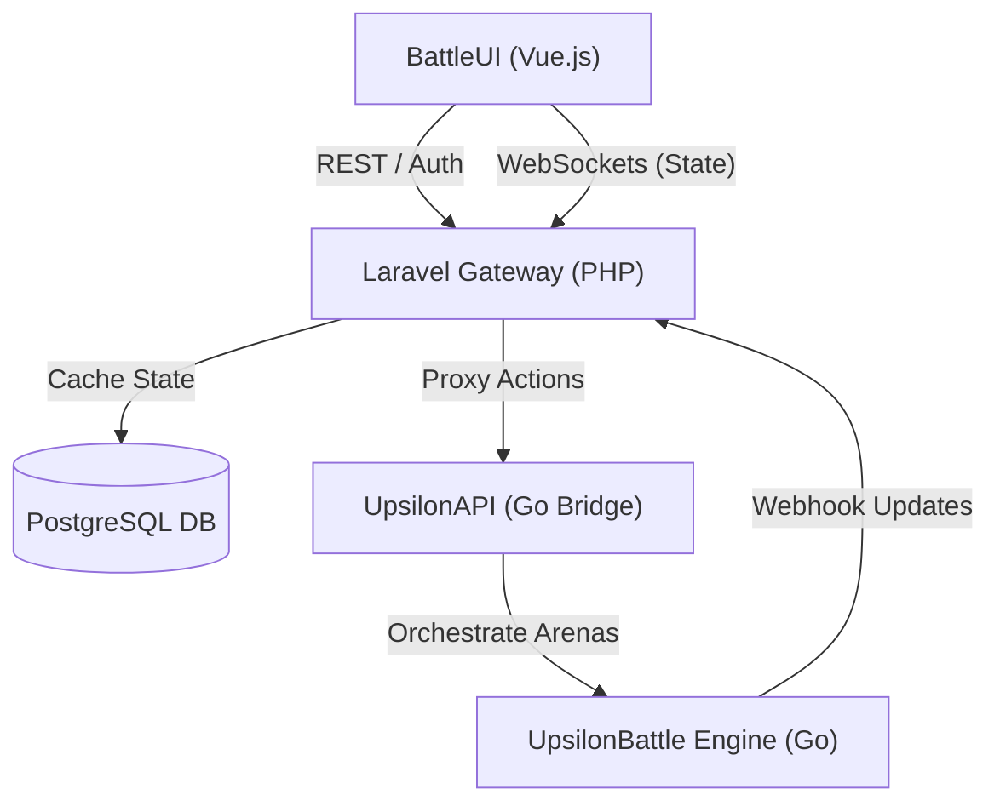

# Software Design Document (SSD) - Upsilon Battle

## 1. User Personas & Roles

### 1.1 Persona: The Player
A tactical RPG enthusiast looking for fast-paced, competitive matches with minimal onboarding friction.

### 1.2 Persona: The Administrator
A system maintainer responsible for managing users and ensuring database performance. Does not participate in combat but has high-level control over account states and match history.

### 1.3 Access Control List (ACL) Roles
Currently, the system operates with a single specialized role:
| Role | Responsibility | Data Access |
|---|---|---|
| **User (Player)** | Account management, joining queues, taking combat turns. | Own profile, own character rosters, public leaderboards, authorized game arenas. |
| **Administrator** | User soft deletion, match history review/cleaning. | Systematic overview (account names, win rates), match results. **No access to private address/birth date.** |

---

## 2. Global Architecture

### 2.1 System Architecture Diagram
The system follows a multi-tier "Proxy and Bridge" architecture to isolate complex Go-based combat logic from the web-facing Laravel gateway.

### 2.2 Communication Protocols
| Link | Protocol | Description |
|---|---|---|
| **Vue.js <-> Laravel** | HTTP & WebSockets | Authentication (Sanctum) and real-time state streaming (Reverb). |
| **Laravel <-> UpsilonAPI** | HTTP & Webhooks | Proxied game actions and async state updates into the Laravel callback. |
| **UpsilonAPI <-> Engine** | Internal Go Channels | High-performance message passing between Ruler and Controllers. |

---

## 3. Software Entities (Detailed)

### 3.1 Laravel Gateway
- **Responsibility:** Serves as the primary ingress point. Manages authentication, session state, and metadata (characters, wins).
- **Inner Working:** 
    - Proxies combat actions to the Go bridge.
    - Listens for webhooks from Go to update the `game_matches` JSON state cache and broadcast to WebSockets.
- **Constraints:** Must not perform complex combat math; only record results and authorize requests.
- **References:** [[api_laravel_gateway]], [[req_security]].

### 3.2 UpsilonAPI (The Bridge)
- **Responsibility:** Provides an HTTP interface for the stateful Go engine. Orchestrates multiple concurrent arenas.
- **Inner Working:** Maintains a registry of active `Ruler` instances and maps them to `arena_ids`.
- **Constraints:** Must be stateless regarding player identity (delegates to Laravel).
- **References:** [[module_upsilonapi]], [[api_go_battle_engine]]

### 3.3 UpsilonBattle Engine
- **Responsibility:** The core TRPG logic processor.
- **Inner Working:** Implements the **Ruler/Controller** pattern.
    - **Ruler:** Acts as the Game Master, enforcing rules (initiative, timer, collision).
    - **Controller:** Acts as the player/AI interface for issuing move/attack commands.
- **Constraints:** Enforces the 30-second shot clock and +400 delay penalty for timeouts.
- **References:** [[module_game]], [[mech_controller_communication_sequence]], [[mech_action_economy]].

---

## 4. Requirement Traceability Matrix

| Requirement ID | Business Requirement | Software Component | implementation Detail | ATD Reference |
|---|---|---|---|---|
| **BR-01** | Frictionless Onboarding | Laravel Gateway | Name/pass/address/birth registration. | [[us_new_player_onboard]] |
| **BR-02** | GDPR Compliance | Laravel Gateway | Soft-delete and Anonymization hooks. | [[rule_gdpr_compliance]] |
| **BR-03** | Data Portability | Laravel Gateway | `/api/profile/export` endpoint. | [[api_profile_export]] |
| **BR-04** | Tactical Combat Engine | UpsilonBattle Engine | Initiative-based turn logic. | [[module_game]] |
| **BR-05** | Turn Timeout Penalty | UpsilonBattle Engine | +400 delay cost logic in Ruler. | [[mech_action_economy]] |
| **BR-06** | Secure Transport | All Components | Mandatory HTTPS (Self-signed ok). | [[req_security]] |
| **BR-07** | Fair Progression | Laravel Gateway | Attribute point allocation gated by wins. | [[rule_progression]] |
| **BR-08** | Real-time Updates | Laravel Gateway | Reverb WebSockets broadcasting. | [[api_laravel_gateway]] |
| **BR-09** | Identity Safety | UpsilonBattle Engine | Friendly fire detection and blocking. | [[rule_friendly_fire]] |
| **BR-10** | System Administration | Laravel Gateway | User listing/deletion; History purge. | [[uc_admin_user_management]] |
| **BR-11** | Admin Privacy Gate | Laravel Gateway | Masking sensitive user fields for admins. | [[rule_admin_access_restriction]] |
| **BR-12** | Secure Admin Seeding | Laravel Gateway | env-based admin account creation. | [[infra_seed_admin]] |
