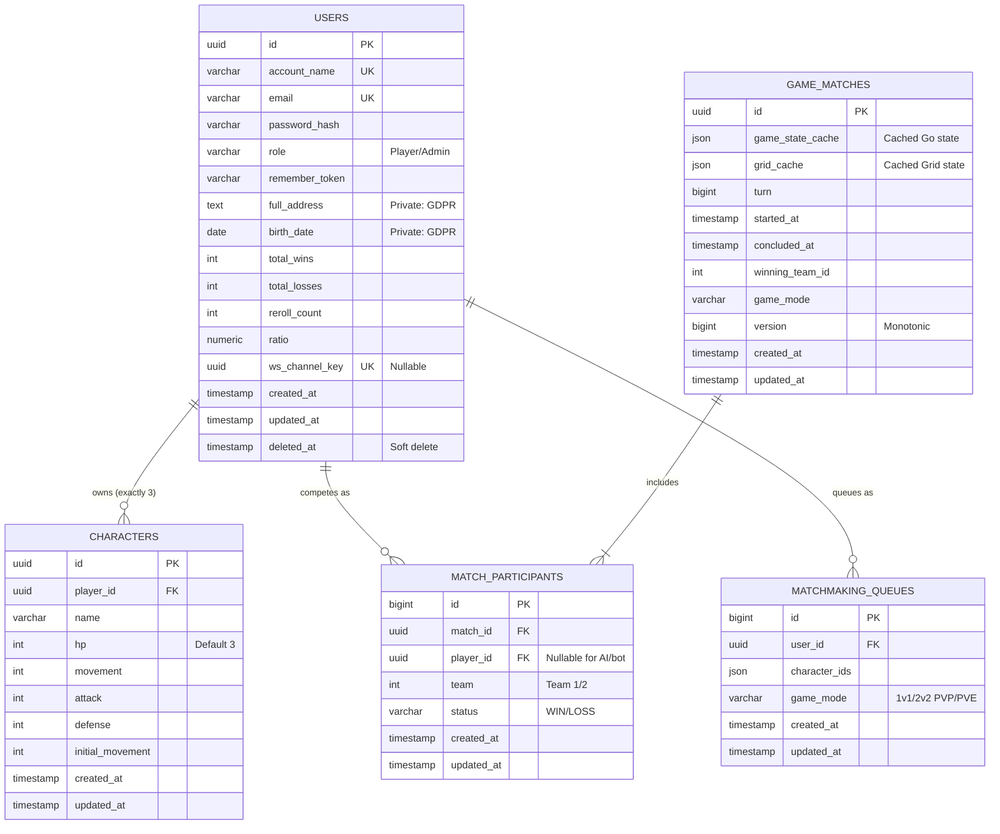

# TRPG Database Schema

*Last Updated: 2026-04-20 based on implementation analysis*

This document outlines the relational boundaries required in the PostgreSQL implementation to support the TRPG Specifications. 

## Tables Summary

### 1. `users` (formerly `players`)
Stores authentication identity and tracks top-level metrics for the generic Leaderboard (`ui_leaderboard`).
* `id` (UUID, Primary Key)
* `account_name` (Varchar, Unique, Not Null)
* `email` (Varchar, Unique, Not Null)
* `password_hash` (Varchar, Not Null)
* `role` (Varchar, Default 'Player') - *For RBAC: Player/Admin*
* `remember_token` (Varchar, Nullable)
* `full_address` (Text, Nullable) - *Private: GDPR protected*
* `birth_date` (Date, Nullable) - *Private: GDPR protected*
* `total_wins` (Int, Default 0)
* `total_losses` (Int, Default 0)
* `reroll_count` (Int, Default 0)
* `ratio` (Numeric, Default 0)
* `ws_channel_key` (UUID, Unique, Nullable) - *For secure WebSocket subscriptions*
* `created_at` (Timestamp)
* `updated_at` (Timestamp)
* `deleted_at` (Timestamp, Nullable) - *Soft delete for GDPR compliance*

**Indexes**: `account_name`, `email`, `ws_channel_key`, `updated_at`
**Constraints**: `role` must be 'Player' or 'Admin'

### 2. `characters`
Stores the individual entities generated via the `entity_character` limits. Linked exclusively to the User.
* `id` (UUID, Primary Key)
* `player_id` (UUID, Foreign Key -> `users.id`)
* `name` (Varchar)
* `hp` (Int, Default 3)
* `movement` (Int)
* `attack` (Int)
* `defense` (Int)
* `initial_movement` (Int) - *For progression cap calculations*
* `created_at` (Timestamp)
* `updated_at` (Timestamp)

**Constraints**: Each player limited to exactly 3 characters (enforced at application level)
**Indexes**: `player_id`

### 3. `game_matches`
Stores active and historical match data, including cached board state from the Go engine.
* `id` (UUID, Primary Key)
* `game_state_cache` (JSON) - *Cached tactical state from Go engine*
* `grid_cache` (JSON) - *Cached grid state from Go engine*
* `turn` (BigInt, Default 0)
* `started_at` (Timestamp)
* `concluded_at` (Timestamp, Nullable)
* `winning_team_id` (Int, Nullable) - *Renamed from winner_team_id*
* `game_mode` (Varchar, Nullable)
* `version` (BigInt, Default 0) - *Monotonic version for state deduplication*
* `created_at` (Timestamp)
* `updated_at` (Timestamp)

**Indexes**: `game_mode`, `started_at`, `winning_team_id`

### 4. `match_participants`
Mapping table defining which Users (or AI agents) competed in a specific historical or active match.
* `id` (BigInt, Primary Key, Auto-increment)
* `match_id` (UUID, Foreign Key -> `game_matches.id`)
* `player_id` (UUID, Foreign Key -> `users.id`, Nullable) - *Nullable for AI/bot participants*
* `team` (Int) - *Team 1 or Team 2*
* `status` (Varchar, Nullable) - *'WIN', 'LOSS' with CHECK constraint*
* `created_at` (Timestamp)
* `updated_at` (Timestamp)

**Indexes**: `match_id`, `player_id`
**Constraints**: `status` must be 'WIN' or 'LOSS'
**Note**: `player_id` is nullable to support AI/bot participants in PvE modes

### 5. `matchmaking_queues` (formerly `matchmaking_queue`)
Active queue entries for users seeking matches.
* `id` (BigInt, Primary Key, Auto-increment)
* `user_id` (UUID, Foreign Key -> `users.id`)
* `character_ids` (JSON) - *Selected characters for the match*
* `game_mode` (Varchar, Default '1v1_PVP')
* `created_at` (Timestamp)
* `updated_at` (Timestamp)

**Indexes**: `user_id`

---

## Entity Relationship Diagram

