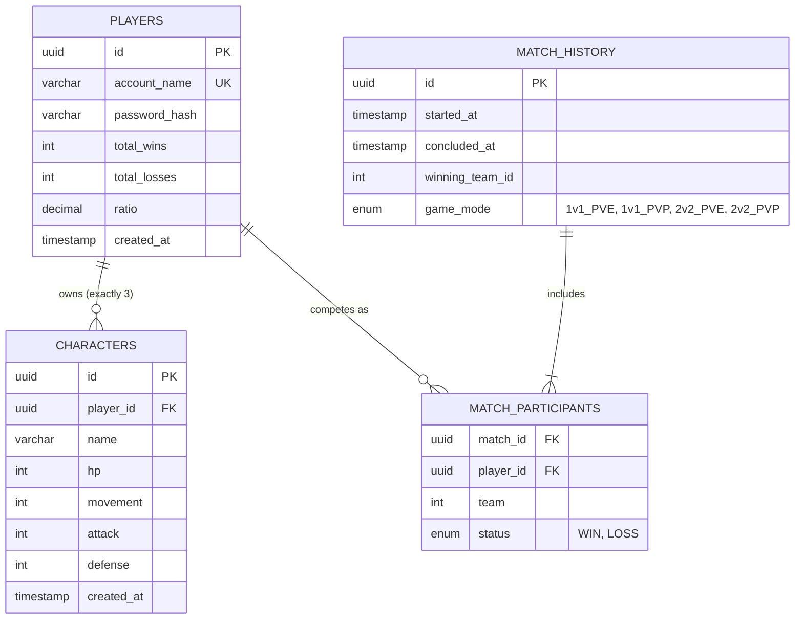

# TRPG Database Schema

*Generated via ATD Synthesis (`data_persistence`)*

This document outlines the proposed relational boundaries required in the PostgreSQL implementation to support the TRPG Specifications. 

## Tables Summary

### 1. `players`
Stores authentication identity and tracks top-level metrics for the generic Leaderboard (`ui_leaderboard`).
* `id` (UUID, Primary Key)
* `account_name` (Varchar, Unique, Not Null)
* `password_hash` (Varchar, Not Null)
* `total_wins` (Int, Default 0)
* `total_losses` (Int, Default 0)
* `ratio` (Decimal calculated/derived)
* `created_at` (Timestamp)

### 2. `characters`
Stores the individual entities generated via the `entity_character` limits. Linked exclusively to the Player.
* `id` (UUID, Primary Key)
* `player_id` (UUID, Foreign Key -> `players.id`)
* `name` (Varchar)
* `hp` (Int, Min 3)
* `movement` (Int)
* `attack` (Int)
* `defense` (Int)
* `created_at` (Timestamp)

### 3. `match_history`
Stores the resolution logs emitted by the Go API (`module_backend`) when a session concludes, triggering player progression rule queries (`rule_progression`).
* `id` (UUID, Primary Key)
* `started_at` (Timestamp)
* `concluded_at` (Timestamp)
* `winning_team_id` (Int (same as match_participants.team))
* `game_mode` (Enum: '1v1_PVE', '1v1_PVP', '2v2_PVE', '2v2_PVP')

### 4. `match_participants`
Mapping table defining which Players competed in a specific historical or active match.
* `match_id` (UUID, Foreign Key -> `match_history.id`)
* `player_id` (UUID, Foreign Key -> `players.id`)
* `team` (Int, e.g., Team 1 or Team 2)
* `status` (Enum: 'WIN', 'LOSS')

## Entity Relationship Diagram

