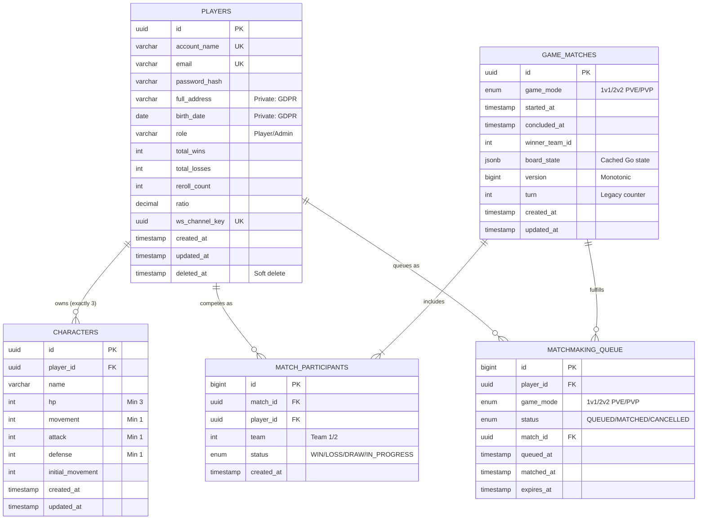
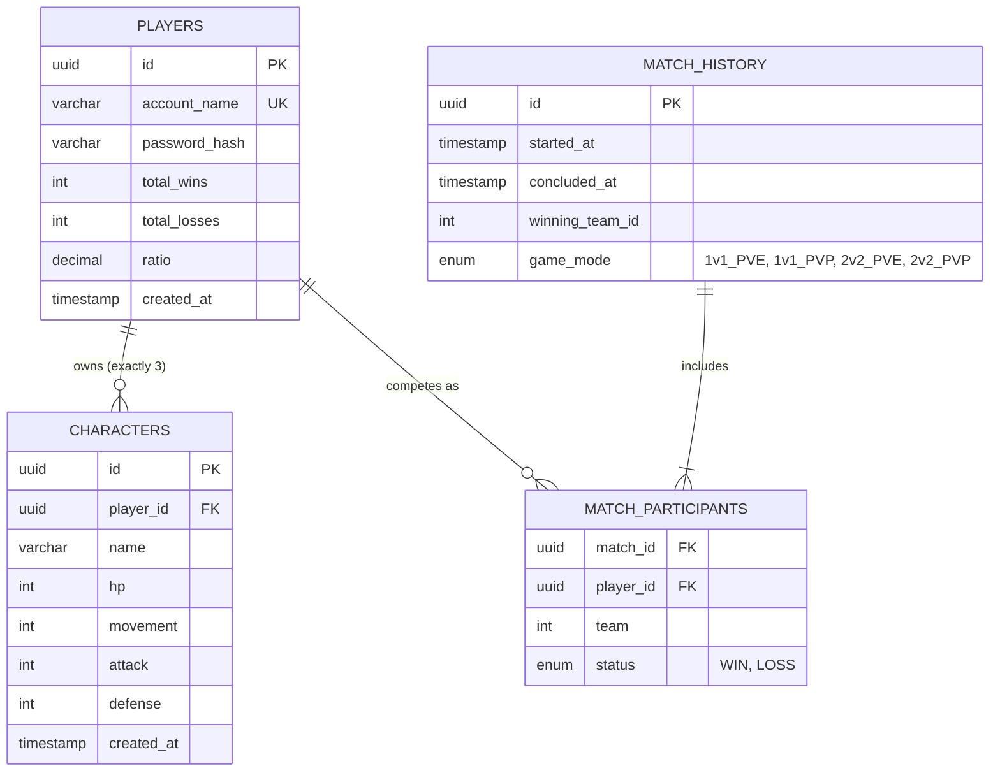

# TRPG Database Schema

*Generated via ATD Synthesis (`data_persistence`)*
*Last Updated: 2026-04-17 based on implementation analysis*

This document outlines the relational boundaries required in the PostgreSQL implementation to support the TRPG Specifications. 

## Tables Summary

### 1. `players`
Stores authentication identity and tracks top-level metrics for the generic Leaderboard (`ui_leaderboard`).
* `id` (UUID, Primary Key)
* `account_name` (Varchar, Unique, Not Null)
* `email` (Varchar, Unique, Not Null)
* `password_hash` (Varchar, Not Null)
* `full_address` (Varchar, Not Null) - *Private: GDPR protected*
* `birth_date` (Date, Not Null) - *Private: GDPR protected*
* `role` (Enum: 'Player', 'Admin', Default 'Player')
* `total_wins` (Int, Default 0)
* `total_losses` (Int, Default 0)
* `reroll_count` (Int, Default 0)
* `ratio` (Decimal calculated/derived)
* `ws_channel_key` (UUID, Unique) - *For secure WebSocket subscriptions*
* `created_at` (Timestamp)
* `updated_at` (Timestamp)
* `deleted_at` (Timestamp, Nullable) - *Soft delete for GDPR compliance*

**Indexes**: `account_name`, `email`, `role`, `total_wins` (for leaderboard queries)

### 2. `characters`
Stores the individual entities generated via the `entity_character` limits. Linked exclusively to the Player.
* `id` (UUID, Primary Key)
* `player_id` (UUID, Foreign Key -> `players.id`)
* `name` (Varchar)
* `hp` (Int, Min 3)
* `movement` (Int, Min 1)
* `attack` (Int, Min 1)
* `defense` (Int, Min 1)
* `initial_movement` (Int) - *For progression cap calculations*
* `created_at` (Timestamp)
* `updated_at` (Timestamp)

**Constraints**: Each player limited to exactly 3 characters (enforced at application level)
**Indexes**: `player_id`, `name`

### 3. `game_matches`
Stores active and historical match data, including cached board state from the Go engine.
* `id` (UUID, Primary Key)
* `game_mode` (Enum: '1v1_PVE', '1v1_PVP', '2v2_PVE', '2v2_PVP')
* `started_at` (Timestamp)
* `concluded_at` (Timestamp, Nullable)
* `winner_team_id` (Int, Nullable) - *0 or null for draw*
* `board_state` (JSONB) - *Cached tactical state from Go engine*
* `version` (BigInt) - *Monotonic version for state deduplication*
* `turn` (Int) - *Legacy turn counter for compatibility*
* `created_at` (Timestamp)
* `updated_at` (Timestamp)

**Indexes**: `game_mode`, `started_at`, `winner_team_id`, `version`
**JSONB Structure**: Contains `players`, `grid`, `turn`, `current_entity_id`, `timeout` fields per [[api_go_battle_engine]]

### 4. `match_participants`
Mapping table defining which Players competed in a specific historical or active match.
* `id` (BigInt, Primary Key, Auto-increment)
* `match_id` (UUID, Foreign Key -> `game_matches.id`)
* `player_id` (UUID, Foreign Key -> `players.id`)
* `team` (Int) - *Team 1 or Team 2*
* `status` (Enum: 'WIN', 'LOSS', 'DRAW', 'IN_PROGRESS')
* `created_at` (Timestamp)

**Indexes**: `match_id`, `player_id`, `status`
**Unique Constraint**: `(match_id, player_id)` - Prevent duplicate participation

### 5. `matchmaking_queue`
Active queue entries for players seeking matches.
* `id` (BigInt, Primary Key, Auto-increment)
* `player_id` (UUID, Foreign Key -> `players.id`)
* `game_mode` (Enum: '1v1_PVE', '1v1_PVP', '2v2_PVE', '2v2_PVP')
* `status` (Enum: 'QUEUED', 'MATCHED', 'CANCELLED', 'EXPIRED')
* `match_id` (UUID, Nullable, Foreign Key -> `game_matches.id`)
* `queued_at` (Timestamp)
* `matched_at` (Timestamp, Nullable)
* `expires_at` (Timestamp) - *Queue entry expiration*

**Indexes**: `player_id`, `game_mode`, `status`, `expires_at`

---

## Entity Relationship Diagram

---

## Data Integrity & Business Rules

### Player Constraints
- **Roster Limit**: Exactly 3 characters per player (enforced at application level)
- **Reroll Limit**: Maximum 3 rerolls during registration (tracked via `players.reroll_count`)
- **Stat Caps**: Total attributes ≤ `10 + total_wins` (enforced via [[rule_progression]])
- **Movement Throttling**: Movement stat upgrades limited to once per 5 wins

### Match Constraints
- **Team Balance**: Valid team compositions enforced by game mode
- **Friendly Fire**: Disabled by [[rule_friendly_fire]] - enforced in Go engine
- **Turn Timer**: 30-second limit per turn with +400 delay penalty for timeout
- **State Consistency**: Version-based deduplication prevents race conditions

### GDPR Compliance
- **Soft Delete**: `deleted_at` timestamp instead of row deletion
- **Data Anonymization**: `full_address` and `birth_date` can be overwritten with "ANONYMIZED"
- **Data Portability**: Complete user data export via [[api_profile_export]]
- **Access Control**: Admin role restricted from viewing private fields per [[rule_admin_access_restriction]]

---

## Performance Considerations

### Indexing Strategy
- **Leaderboard Queries**: `players.total_wins` indexed for ranking queries
- **Match History**: `game_matches.started_at` indexed for temporal queries
- **Queue Management**: `matchmaking_queue.expires_at` indexed for cleanup jobs
- **User Lookup**: `players.account_name` and `players.email` unique indexes

### Caching Strategy
- **Board State**: Cached in `game_matches.board_state` to avoid Go engine queries
- **Leaderboard**: Materialized views or application-level caching for rankings
- **Session Data**: WebSocket channel keys for real-time state distribution

### Cleanup Jobs
- **Expired Queue Entries**: Remove entries older than 5 minutes
- **Match History**: Soft delete matches older than 90 days (GDPR retention)
- **Orphaned Records**: Cleanup job for unmatched queue entries

---

## Migration Strategy

### Database Versioning
- Use Laravel migrations for schema changes
- Version control all structural modifications
- Maintain backward compatibility where possible

### Data Seeding
- **Admin Account**: Environment-based admin creation per [[infra_seed_admin]]
- **Test Data**: Seed data for development and testing environments
- **Leaderboard Reset**: Weekly leaderboard cycle via data archiving

---

## Security Considerations

### Access Control
- **Row-Level Security**: Players can only access their own data
- **Admin Restrictions**: Limited data access per [[rule_admin_access_restriction]]
- **API Security**: All database access mediated through API layer

### Data Protection
- **Encryption**: Password hashing using bcrypt
- **Privacy**: Private fields excluded from public queries
- **Audit Trail**: Timestamps on all modifications for compliance

---

## Monitoring & Maintenance

### Health Checks
- **Connection Pool Monitoring**: Track database connection usage
- **Query Performance**: Monitor slow queries and optimize indexes
- **Storage Growth**: Track JSONB storage growth in `board_state`

### Backup Strategy
- **Regular Backups**: Daily automated backups
- **Point-in-Time Recovery**: WAL archiving for PostgreSQL
- **Testing Restore**: Monthly restore testing for disaster recovery

## Entity Relationship Diagram

