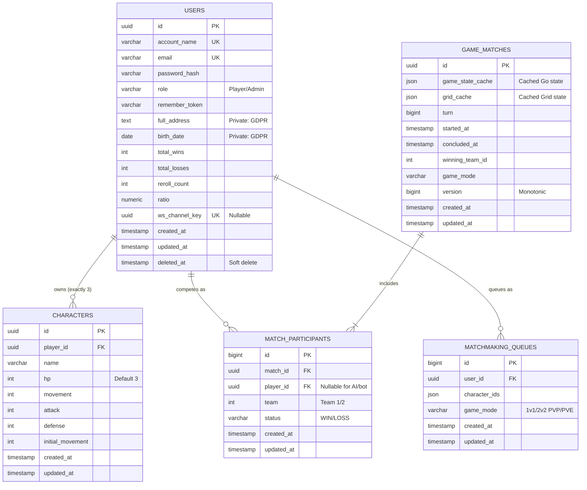

# TRPG Database Schema

*Last Updated: 2026-04-27 — ISS-073/086 skill system + D11 exotic item skill binding*

This document outlines the relational boundaries required in the PostgreSQL implementation to support the TRPG Specifications. 

## Tables Summary

### 1. `users` (formerly `players`)
Stores authentication identity and tracks top-level metrics for the generic Leaderboard (`ui_leaderboard`).
* `id` (UUID, Primary Key)
* `account_name` (Varchar, Unique, Not Null)
* `email` (Varchar, Unique, Not Null)
* `password_hash` (Varchar, Not Null)
* `role` (Varchar, Default 'Player') - *For RBAC: Player/Admin*
* `remember_token` (Varchar, Nullable)
* `full_address` (Text, Nullable) - *Private: GDPR protected*
* `birth_date` (Date, Nullable) - *Private: GDPR protected*
* `total_wins` (Int, Default 0)
* `total_losses` (Int, Default 0)
* `reroll_count` (Int, Default 0)
* `ratio` (Numeric, Default 0)
* `credits` (BigInt, **Default 1000**) - *V2 starting balance per [[shared:rule_starting_credits_1000]]*
* `ws_channel_key` (UUID, Unique, Nullable) - *For secure WebSocket subscriptions*
* `created_at` (Timestamp)
* `updated_at` (Timestamp)
* `deleted_at` (Timestamp, Nullable) - *Soft delete for GDPR compliance*

**Indexes**: `account_name`, `email`, `ws_channel_key`, `updated_at`
**Constraints**: `role` must be 'Player' or 'Admin'

### 2. `characters`
Stores the individual entities generated via the `entity_character` limits. Linked exclusively to the User.
* `id` (UUID, Primary Key)
* `player_id` (UUID, Foreign Key -> `users.id`)
* `name` (Varchar)
* `hp` (Int, Default 30) - *V2 baseline; treated as max HP off-battle*
* `mp` (Int, Default 10) - *Mana resource; Class A CP-upgradable per [[shared:rule_progression]]*
* `sp` (Int, Default 10) - *Stamina resource; Class A CP-upgradable*
* `attack` (Int, Default 10)
* `defense` (Int, Default 5)
* `movement` (Int, Default 3)
* `jump_height` (Int, Default 2) - *Class A CP-upgradable (15 CP per +1)*
* `crit_chance` (Int, Default 0) - *Percent; Class A CP-upgradable (10 CP per +1%)*
* `crit_damage` (Int, Default 0) - *Percent multiplier; Class A CP-upgradable (5 CP per +5%)*
* `initial_movement` (Int) - *For progression cap calculations*
* `spent_cp` (Int, Default 0)
* `created_at` (Timestamp)
* `updated_at` (Timestamp)

**Constraints**: Each player limited to exactly 3 characters (enforced at application level)
**Indexes**: `player_id`
**Class B stats** (AttackRange, Shield) are NOT persisted — granted by items/buffs only per [[shared:rule_stat_taxonomy]].

### 3. `game_matches`
Stores active and historical match data, including cached board state from the Go engine.
* `id` (UUID, Primary Key)
* `game_state_cache` (JSON) - *Cached tactical state from Go engine*
* `grid_cache` (JSON) - *Cached grid state from Go engine*
* `turn` (BigInt, Default 0)
* `started_at` (Timestamp)
* `concluded_at` (Timestamp, Nullable)
* `winning_team_id` (Int, Nullable) - *Renamed from winner_team_id*
* `game_mode` (Varchar, Nullable)
* `version` (BigInt, Default 0) - *Monotonic version for state deduplication*
* `created_at` (Timestamp)
* `updated_at` (Timestamp)

**Indexes**: `game_mode`, `started_at`, `winning_team_id`

### 4. `match_participants`
Mapping table defining which Users (or AI agents) competed in a specific historical or active match.
* `id` (BigInt, Primary Key, Auto-increment)
* `match_id` (UUID, Foreign Key -> `game_matches.id`)
* `player_id` (UUID, Foreign Key -> `users.id`, Nullable) - *Nullable for AI/bot participants*
* `team` (Int) - *Team 1 or Team 2*
* `status` (Varchar, Nullable) - *'WIN', 'LOSS' with CHECK constraint*
* `created_at` (Timestamp)
* `updated_at` (Timestamp)

**Indexes**: `match_id`, `player_id`
**Constraints**: `status` must be 'WIN' or 'LOSS'
**Note**: `player_id` is nullable to support AI/bot participants in PvE modes

### 5. `matchmaking_queues` (formerly `matchmaking_queue`)
Active queue entries for users seeking matches.
* `id` (BigInt, Primary Key, Auto-increment)
* `user_id` (UUID, Foreign Key -> `users.id`)
* `character_ids` (JSON) - *Selected characters for the match*
* `game_mode` (Varchar, Default '1v1_PVP')
* `created_at` (Timestamp)
* `updated_at` (Timestamp)

**Indexes**: `user_id`

### 6. `shop_items`
Admin-managed item catalog. Three rows seeded with deterministic UUIDs; further rows added via admin CRUD (ISS-086). See [[entity_shop_item]].
* `id` (UUID, Primary Key)
* `name` (Varchar 100)
* `type` (Varchar 32) - *Legacy category: armor / weapon / movement / utility*
* `slot` (Varchar 16) - *CHECK: armor | utility | weapon*
* `properties` (JSON) - *Engine `ItemProperties` map (e.g. `{"ArmorRating":5}`)*
* `cost` (Int) - *Credit cost per unit; V2.0 fixed prices per [[rule_item_pricing_simple]]*
* `available` (Bool, Default true)
* `skill_template_id` (UUID, Nullable, FK -> `skill_templates.id`, SET NULL) - *D11: exotic items only; NULL for vanilla weapons/armor*
* `version` (Varchar 10, Default '2.0')
* `created_at` / `updated_at` (Timestamps)

### 7. `player_inventory`
Per-user owned items. Ownership only — equip state lives in `character_equipment` (D1 of ISS-074). See [[upsilonbattle:entity_player_inventory]].
* `id` (UUID, Primary Key)
* `player_id` (UUID, FK -> `users.id`, CASCADE)
* `shop_item_id` (UUID, FK -> `shop_items.id`)
* `quantity` (Int, Default 1) - *Capped at 99 in `ShopService` per [[shared:rule_quantity_cap]]*
* `purchased_at` (Timestamp, Default now())
* `created_at` / `updated_at` (Timestamps)

**Indexes**: `player_id`
**Constraints**: UNIQUE(`player_id`, `shop_item_id`) — duplicate purchases increment quantity rather than insert.

### 8. `inventory_transactions`
Audit trail for inventory changes. See [[upsilonbattle:mec_credit_spending_shop]].
* `id` (UUID, Primary Key)
* `player_id` (UUID, FK -> `users.id`, CASCADE)
* `shop_item_id` (UUID, FK -> `shop_items.id`)
* `quantity` (Int)
* `credits_spent` (Int)
* `transaction_type` (Varchar 16, Default 'purchase') - *CHECK: purchase | refund | gift | admin_grant*
* `created_at` / `updated_at` (Timestamps)

**Indexes**: `player_id`

### 9. `character_equipment`
3-slot equipment binding. Single source of truth for "what a character has equipped". See [[upsilonbattle:entity_character_equipment]].
* `character_id` (UUID, Primary Key, FK -> `characters.id`, CASCADE)
* `armor_item_id` (UUID, Nullable, FK -> `player_inventory.id`, SET NULL)
* `utility_item_id` (UUID, Nullable, FK -> `player_inventory.id`, SET NULL)
* `weapon_item_id` (UUID, Nullable, FK -> `player_inventory.id`, SET NULL)
* `created_at` / `updated_at` (Timestamps)

**Constraints (service-layer)**:
- Slot of bound inventory row must match the column (armor/utility/weapon) — enforced in `EquipmentService`.
- A given `player_inventory` row may be referenced by at most ONE slot across ALL of the user's characters at any time (cross-character mutual exclusivity, atomic).

---

### 10. `skill_templates`
Admin-managed skill design library. Each row is a canonical skill definition that players can roll from or that exotic items can reference. See [[entity_skill_template]], [[rule_admin_content_authority]].
* `id` (UUID, Primary Key)
* `name` (Varchar 100)
* `behavior` (Varchar 16) - *CHECK: Direct | Reaction | Passive | Counter | Trap*
* `targeting` (JSON) - *Engine property map for targeting rules*
* `costs` (JSON) - *Engine property map for resource costs*
* `effect` (JSON) - *Engine effect bundle (damage / heal / status)*
* `grade` (Varchar 8) - *CHECK: I | II | III | IV | V*
* `weight_positive` (Int, Default 0) - *Positive Skill Weight used for grading and credit cost*
* `weight_negative` (Int, Default 0) - *Negative Skill Weight (penalties)*
* `available` (Bool, Default true) - *Soft-disable without deleting*
* `version` (Varchar 10, Default '2.0')
* `created_at` / `updated_at` (Timestamps)

### 11. `character_skills`
Per-character skill inventory with snapshot model (ISS-073). See [[entity_character_skill_inventory]], [[rule_character_skill_slots]].
* `id` (UUID, Primary Key)
* `character_id` (UUID, FK -> `characters.id`, CASCADE)
* `skill_template_id` (UUID, Nullable, FK -> `skill_templates.id`, SET NULL) - *Informational: tracks origin template; never re-read at battle time*
* `source` (Varchar 16) - *CHECK: roll | template | shop | grant | item — V2.0 wires 'roll' only*
* `instance_data` (JSON) - *Full skill snapshot at acquisition time; stable regardless of template edits*
* `equipped` (Bool, Default false)
* `acquired_at` (Timestamp, Default now())
* `equipped_at` (Timestamp, Nullable)
* `created_at` / `updated_at` (Timestamps)

**Indexes**: `(character_id, equipped)` — fast lookup of a character's equipped skills at battle-init.
**Constraints (service-layer)**: count of `equipped=true` rows per character must not exceed `min(5, 1 + floor(player.total_wins / 10))` — enforced atomically in `SkillService`.
**Note**: `source='item'` is reserved but never INSERTed in V2.0. Item-derived skills are virtualized at battle-init time by `UpsilonEntityResource` scanning equipped items with a non-NULL `shop_items.skill_template_id`.

---

## Entity Relationship Diagram

