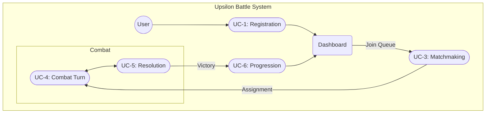
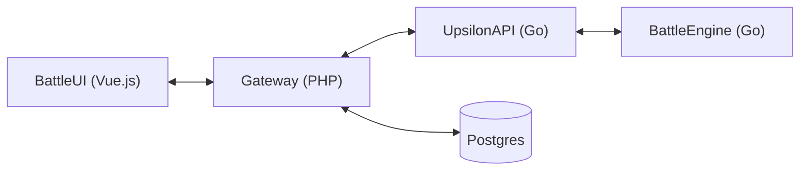
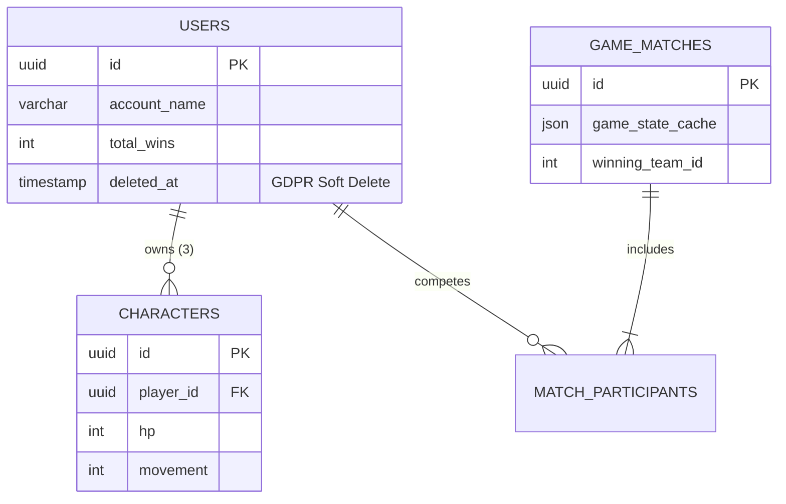

# Upsilon Battle : Documentation Complète du Projet

## Table des Matières

1. [Préface](#1-préface)
2. [Introduction : Vision & Objectifs Business](#2-introduction--vision--objectifs-business)
3. [Mécaniques de Jeu & Progression](#3-mécaniques-de-jeu--progression)
    - 3.1 [Core Gameplay](#31-core-gameplay)
    - 3.2 [Système de Personnages & Roster](#32-système-de-personnages--roster)
    - 3.3 [Économie de Combat & Shot Clock](#33-économie-de-combat--shot-clock)
4. [Flux Fonctionnels : Use Cases](#4-flux-fonctionnels--use-cases)
5. [Architecture & Design](#5-architecture--design)
    - 5.1 [Architecture Système](#51-architecture-système)
    - 5.2 [Workflows Clés (Login, Matchmaking, Combat, Progression)](#52-workflows-clés)
    - 5.3 [Communication API & Collections Postman](#53-communication-api--collections-postman)
6. [Schéma de la Database](#6-schéma-de-la-database)
7. [CI/CD & Contrôle Qualité](#7-cicd--contrôle-qualité)
8. [Appendix : ATD & Santé du Projet](#8-appendix--atd--santé-du-projet)
    - 8.1 [ATD (Atomic Traceable Documentation)](#81-atd-atomic-traceable-documentation)
    - 8.2 [Stats Projet & Conformité](#82-stats-projet--conformité)
    - 8.3 [Points de Friction & Évolution](#83-points-de-friction--évolution)
9. [Exemples Upsilon CLI](#9-exemples-upsilon-cli)
10. [Conclusion](#10-conclusion)

---

## 1. Préface

Je profite de ce court encart pour aborder la question de l’IA et de son usage au sein de ce projet.

L'intelligence artificielle a été omniprésente durant ce développement, et ce pour de multiples raisons que je détaille ci-dessous.

### Les Outils

* **Antigravity (Gemini)** : utilisé comme IDE pour soutenir le développement de la solution.
* **Z.Ai (via Claude Code)** : m'a servi pour effectuer des passes de vérification et d'investigation au sens large.
* **Via Ollama (en local)** :
    * `nomic-embed-text` : pour la recherche sémantique.
    * `llama3.2` (1b, 3b) & `llama3.1:8b` : pour les micro-tâches de comparaison et de résumé.
    * `deepseek-r1:7b` : pour l’analyse et la génération de texte plus poussée.
    * `qwen2.5-coder:14b` : pour l’analyse de code.

### Impact sur le projet

Le projet est vaste et j'ai parfois un peu "débordé des clous", mais l'occasion était trop belle pour ne pas en profiter :

* **Front (Vue.js)** : 100 % écrit par Gemini. Je n'ai jamais eu la "fibre front". Même si je trouve le combo Vue.js + Tailwind sympathique, ce n'est toujours pas ma tasse de thé.
* **Gateway API (Laravel)** : 90 % (honnêtement, ce que j’ai écrit moi-même a probablement été remplacé entre-temps). Laravel est efficace, mais je regrette l’absence native de support pour la documentation d’API. Cela reste du PHP, une technologie dont je ne suis pas un grand fan.
* **Upsilon CLI** : 100 % écrit par Gemini. Il s'agit d'un front-end alternatif en ligne de commande (d’où le nom). Ce module, comme le reste du backend, est en Go. C'est un langage que j'apprécie énormément.
* **Upsilon (le reste)** : 5 % édité par Gemini. Il s'agit d'un projet "legacy" issu de ma production personnelle (datant de 4, 5 ou 6 ans, je ne sais plus). Pour ce projet, nous n'utilisons que 60 % de ses capacités, et les modifications récentes sont principalement des corrections de bugs.
* **CI / CD / Tests** : 100 % Gemini. C'est une partie nécessaire, mais avouons-le : c'est extrêmement rébarbatif.
* **Documentation** : C’est plus nuancé. Je dirais entre 60 % et 80 %. J'ai passé un temps infini sur l'aspect documentaire, et c'est un point qui me tient à cœur.

### À propos de la documentation (ATD)

Je travaille sur mon temps libre sur un outil destiné à faciliter la documentation, tâche que j'ai toujours considérée comme ingrate. En 12 ans de carrière, j'ai passé un temps fou à rédiger des documents que seules 0,2 personne ont dû lire.

Un bon document doit être ciblé, concis et pratique. Or, les specs client, les dossiers fonctionnels, les plans de test ou les manuels d'entretien sont souvent une plaie à produire et à maintenir. Au mieux, ils sont parcourus du regard pour vérifier que la grammaire est correcte. S'ils sont destinés au client, un manager y jettera peut-être un œil. Ensuite, selon le client, c'est soit 200 % d'attention, soit 10 %.

Vient ensuite la doc "dev", la passation pour l'équipe et les futurs développeurs. C'est le document qui est toujours obsolète, mal étiqueté et incompréhensible, et que l'on ne retrouve jamais quand on en a vraiment besoin.

L'objectif de mon projet **ATD (Atomic Traceable Documentation)** est de produire une documentation minimaliste, ciblée et surtout dont la maintenance est automatisée. La documentation vit dans le dépôt du projet (en relation directe avec le code). Des outils sont présents pour visualiser les écarts entre le code et la doc, effectuer des recherches et, idéalement, générer une documentation ponctuelle basée sur la réalité du terrain. Il y a même une interface web !

L'ambition est grande, mais la réalité est forcément plus complexe. Les défis sont nombreux : mes idées ne sont pas encore totalement organisées et le projet manque de maturité. Cependant, l'étude empirique est passionnante et je trouve le résultat, bien que perfectible, plutôt encourageant.

> **Note d'usage** : Si vous croisez dans le code des balises type `[[rule_password_policy]]`, cela signifie qu'un bloc de doc y est associé. Un coup de `Ctrl+P` avec le nom vous permettra de mettre la main dessus (j'ai développé une extension VS Code pour le Ctrl+Click et le détail au survol). Au besoin, je peux fournir le dépôt.

Pour finir, j'écris habituellement mes documentations en anglais. Je vais faire traduire le document principal, mais le reste de la documentation technique restera en anglais.

---

## 2. Introduction : Vision & Objectifs Business

Upsilon Battle est un Tactical RPG (TRPG) nerveux, designé pour du combat au tour par tour ultra-compétitif.

### 2.1 Project Vision
L'objectif est d'offrir une expérience tactique profonde avec des mécaniques d'initiative dynamiques, une progression de perso modulaire, et une architecture API-first pensée pour les joueurs humains comme pour les bots.

### 2.2 Objectifs Business
- **Réactivité** : Engagement instantané via PvE et un matchmaking PvP haute performance.
- **Équilibrage** : Intégrité numérique garantie par un scaling de progression strict.
- **Traçabilité** : Chaque requirement est mappé à une spec interne (ATOM) et validé en CI.

---

## 3. Mécaniques de Jeu & Progression

### 3.1 Core Gameplay
- **Grid-Based Combat** : Les battles se passent sur une grille générée aléatoirement (5x5 à 15x15) avec des obstacles procéduraux.
- **Conditions de Victoire** : Élimination totale de la team adverse. Le Friendly Fire est désactivé par défaut pour focus sur la tactique.

### 3.2 Système de Personnages & Roster
Chaque joueur gère un roster de **précisément 3 personnages**.
- **Initial Roll** : Les persos commencent avec des stats de base (3 HP, 1 Move, 1 Attack, 1 Def) + 4 points dispatchés au hasard.
- **Mécanique de Reroll** : Au register, l'user peut reroll son roster jusqu'à **3 fois**.
- **Progression des Stats** : Gagner un match rapporte **1 Point d'Attribut**.
    - **Cap** : Le total d'attributs ne peut pas dépasser `10 + nombre de wins`.
    - **Gating du Movement** : La stat de Move ne peut être upgradée qu'une fois toutes les 5 wins.

### 3.3 Économie de Combat & Shot Clock
- **Initiative** : Le tour par tour est calculé via un système de "Delay Cost" (pré-initiative 1-500). Le tour trigger quand le ticker tombe à 0.
- **Coûts des Actions** :
    - **Move** : +20 de delay par case.
    - **Attack** : +100 de delay.
    - **Pass** : +300 de delay.
- **La Shot Clock** : Les joueurs ont **30 secondes** pour agir. En cas d'AFK, le serveur force un **Auto-Pass** avec une pénalité (+400 de delay au total).

---

## 4. Flux Fonctionnels : Use Cases

Le diagramme suivant illustre le parcours client principal, du registration au match resolution, jusqu'à l'évolution du perso.



### Cas d'Utilisation Clés
- **UC-1: Player Registration** : Création du compte et rerolls du roster initial.
- **UC-3: Matchmaking** : Entrée dans le pool PvE (Instant) ou PvP (File d'attente).
- **UC-4 & UC-5** : La boucle tactique principale et le calcul de la victoire.
- **UC-6: Progression** : Allocation manuelle des points d'attribut gagnés après une win.

---

## 5. Architecture & Design

### 5.1 Architecture Système
Upsilon utilise une architecture **"Proxy and Bridge"** pour isoler la gateway web du moteur de combat qui est plus lourd.



- **Frontend** : Vue.js 3 gère le rendu tactique et le state de la session.
- **Gateway (Laravel)** : Gère l'auth (Sanctum), la persistence, et broadcast le state via WebSockets (Reverb).
- **Go Bridge & Engine** : Logique de combat stateless, calcul d'initiative et orchestration des arènes.

### 5.2 Workflows Clés

#### A. Auth & Session
1. L'user envoie ses credentials à l'endpoint `/auth/login`.
2. Laravel valide et release un JWT (Bearer Token).
3. L'UI utilise ce token pour toutes les requêtes suivantes et l'auth WebSocket.

#### B. Matchmaking & Arena Start
1. Le joueur join une queue (`/matchmaking/join`).
2. Dès qu'un match est trouvé, Laravel demande un start d'arène au Go Bridge.
3. L'Engine initialise le board et renvoie un webhook `game.started` à Laravel.
4. Laravel cache le state et le broadcast aux joueurs via WebSockets.

#### C. Interaction en Combat
1. Le joueur actif envoie une action de Move ou Attack au `/game/{id}/action`.
2. Laravel valide l'ownership et proxy la requête vers l'Engine Go.
3. L'Engine process la logique (portée, collisions, dégâts) et renvoie le nouveau state.
4. Laravel ingère le state, update le cache et broadcast `board.updated`.

### 5.3 Communication API & Collections Postman
Pour une ref technique complète, go voir la [Documentation API détaillée](file:///home/bastien/work/upsilon/projbackend/communication.md). On met aussi à dispo des collections directement importables :
- **`Upsilon_Battle.postman_collection.json`** : Les actions player standard (Auth, Roster, Matchmaking).
- **`Upsilon_Engine_Internal.postman_collection.json`** : Orchestration bas niveau du moteur.

---

## 6. Schéma de la Database

Le système utilise PostgreSQL pour le source of truth des joueurs et de l'historique des matches.



---

## 7. CI/CD & Contrôle Qualité

Upsilon Battle utilise un pipeline de validation robuste pour garantir la haute dispo et la justesse de la logique.

- **Lint & Build** : Checks de syntaxe obligatoires pour Go et PHP, push et build des images.
- **Unit Tests** : Vérification isolée de la logique de calcul de combat et des handlers d'API.
- **Scénarios E2E** : Stack Docker orchestrée (`docker-compose.ci.yaml`) faisant tourner des simulations de matches complets via des bots en CLI.
- **Suite d'Edge Cases** : Plus de 48 tests ciblés sur les conditions aux limites (ex: collision lors d'un move, actions non autorisées).

> **Statut actuel du Build** : Tous les systèmes sont au vert (Build/Lint/E2E). Note : 2-3 flakes mineurs observés sur les tests unitaires de `upsilonbattle` et de l'API sous forte charge de concurrence.

---

## 8. Appendix : ATD & Santé du Projet

### 8.1 ATD (Atomic Traceable Documentation)
Le projet repose sur le **framework ATD**. La doc est composée d'**Atomes** indépendants (`.atom.md`) décrivant précisément une règle ou mécanique. Ces atomes sont liés bidirectionnellement au code via des tags `@spec-link`.

### 8.2 Stats Projet & Conformité
- **Total ATOMs** : 245
- **Taux d'Implémentation** : ~88.5 %
- **Traçabilité** : Plus de 421 liens à travers 250+ fichiers.
- **Conformité** : 100 % des requirements business critiques (Password policy, GDPR, progression) ont des scripts de vérification automatisés.

### 8.3 Points de Friction & Évolution
Focus actuel et dette technique :
- **Concurrence** : Investigation sur des deadlocks rares dans l' `ArenaBridge` Go en cas d'extreme load (ISS-056).
- **Edge Cases Logique** : Raffinement de la détection de collision pour les entités "mortes" (ISS-059).
- **Gaps de Traçabilité** : Standardisation de la propagation de l' `Request-ID` sur les webhooks asynchrones (ISS-042).
- **Évolution Prévue** : Implémentation d'un système de "Holo-Emotes" procédural pour la socialisation in-game.

---

## 9. Exemples Upsilon CLI

L' `upsiloncli` est un outil puissant pour inspecter et simuler l'environnement du jeu.

### Registration & Login
```bash
# Simuler une registration de nouveau joueur
curl -X POST -d '{"account_name":"dev_hero", "password":"..."}' http://localhost:8000/api/v1/auth/register
```

### Matchmaking & Game State
```bash
# Rejoindre la file d'attente PvP
curl -X POST -d '{"game_mode":"1v1_PVP"}' http://localhost:8000/api/v1/matchmaking/join

# Inspecter le state d'un board en live (extrait des logs)
# GET /api/v1/game/{match_id}
{
  "match_id": "019daa27-1a38-...",
  "game_state": {
    "players": [...],
    "grid": {"width": 10, "height": 10},
    "current_entity_id": "019daa27-19a8-...",
    "timeout": "2026-04-20T09:10:12Z"
  }
}
```

### Combat Actions
```bash
# Envoyer un move
curl -X POST -d '{"type":"move", "target_coords":[{"x":2, "y":3}]}' http://localhost:8000/api/v1/game/{id}/action
```

---

## 10. Conclusion

[Espace réservé pour les notes finales et la clôture du projet]
