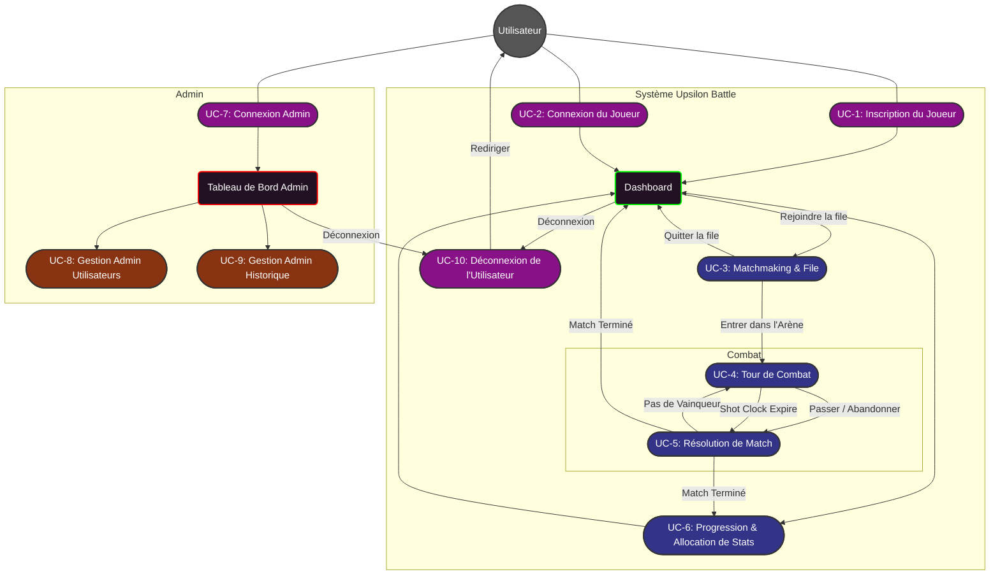
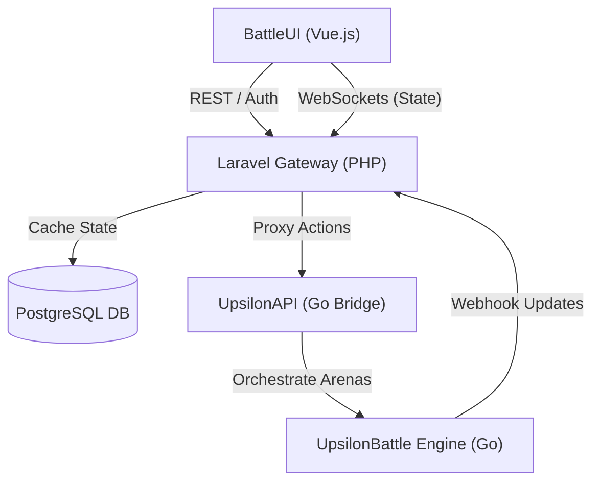
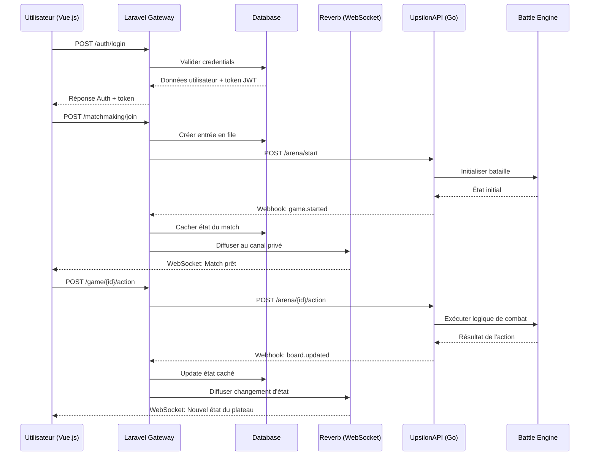
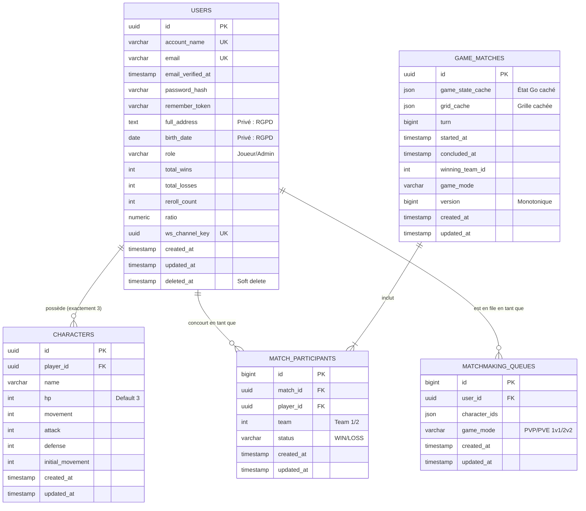

# Upsilon Battle : Documentation Complète du Projet

## Table des Matières

1. [Préface](#1-préface)
2. [Vision & Objectifs Business](#2-vision--objectifs-business)
3. [Exigences Fonctionnelles](#3-exigences-fonctionnelles)
4. [Exigences Non-Fonctionnelles](#4-exigences-non-fonctionnelles)
5. [Tableau de Bord & Interfaces](#5-tableau-de-bord--interfaces)
6. [Cas d'Utilisation (Use Cases - Schémas)](#6-cas-dutilisation-use-cases---schémas)
7. [Détail des Cas d'Utilisation (UC-1 à UC-10)](#7-détail-des-cas-dutilisation-uc-1-%C3%A0-uc-10)
8. [Mécaniques de Jeu & Progression](#8-mécaniques-de-jeu--progression)
9. [Architecture Système](#9-architecture-système)
10. [Entités Logicielles (Détails)](#10-entités-logicielles-détails)
11. [Détails d'Implémentation & Stack](#11-détails-dimplémentation--stack)
12. [Modèle de Données (PostgreSQL)](#12-modèle-de-données-postgresql)
13. [Communication & Protocoles](#13-communication--protocoles)
14. [Interface API (Détails)](#14-interface-api-détails)
15. [Workflows Clés & Collections Postman](#15-workflows-clés--collections-postman)
16. [CI/CD, Tests & Conformité](#16-cicd-tests--conformité)
17. [Appendix : ATD & Santé du Projet](#17-appendix--atd--santé-du-projet)
18. [Conclusion](#18-conclusion)

---

## 1. Préface

Je profite de ce court encart pour aborder la question de l’IA et de son usage au sein de ce projet.

L'intelligence artificielle a été omniprésente durant ce développement, et ce pour de multiples raisons que je détaille ci-dessous.

### Les Outils

* **Antigravity (Gemini)** : utilisé comme IDE pour soutenir le développement de la solution.
* **Z.Ai (via Claude Code)** : m'a servi pour effectuer des passes de vérification et d'investigation au sens large.
* **Via Ollama (en local)** :
    * `nomic-embed-text` : pour la recherche sémantique.
    * `llama3.2` (1b, 3b) & `llama3.1:8b` : pour les micro-tâches de comparaison et de résumé.
    * `deepseek-r1:7b` : pour l’analyse et la génération de texte plus poussée.
    * `qwen2.5-coder:14b` : pour l’analyse de code.

### Impact sur le projet

Le projet est vaste et j'ai parfois un peu "débordé des clous", mais l'occasion était trop belle pour ne pas en profiter :

* **Front (Vue.js)** : 100 % écrit par Gemini. Je n'ai jamais eu la "fibre front". Même si je trouve le combo Vue.js + Tailwind sympathique, ce n'est toujours pas ma tasse de thé.
* **Gateway API (Laravel)** : 90 % (honnêtement, ce que j’ai écrit moi-même a probablement été remplacé entre-temps). Laravel est efficace, mais je regrette l’absence native de support pour la documentation d’API. Cela reste du PHP, une technologie dont je ne suis pas un grand fan.
* **Upsilon CLI** : 100 % écrit par Gemini. Il s'agit d'un front-end alternatif en ligne de commande (d’où le nom). Ce module, comme le reste du backend, est en Go. C'est un langage que j'apprécie énormément.
* **Upsilon (le reste)** : 5 % édité par Gemini. Il s'agit d'un projet "legacy" issu de ma production personnelle (datant de 4, 5 ou 6 ans, je ne sais plus). Pour ce projet, nous n'utilisons que 60 % de ses capacités, et les modifications récentes sont principalement des corrections de bugs.
* **CI / CD / Tests** : 100 % Gemini. C'est une partie nécessaire, mais avouons-le : c'est extrêmement rébarbatif.
* **Documentation** : C’est plus nuancé. Je dirais entre 60 % et 80 %. J'ai passé un temps infini sur l'aspect documentaire, et c'est un point qui me tient à cœur.

Mon objectif personnel est d'apprendre à maîtriser cette technologie. 

### À propos de la documentation (ATD)

Je travaille sur mon temps libre sur un outil destiné à faciliter la documentation, tâche que j'ai toujours considérée comme ingrate. En 12 ans de carrière, j'ai passé un temps fou à rédiger des documents que seules 0,2 personne ont dû lire.

Un bon document doit être ciblé, concis et pratique. Or, les specs client, les dossiers fonctionnels, les plans de test ou les manuels d'entretien sont souvent une plaie à produire et à maintenir. Au mieux, ils sont parcourus du regard pour vérifier que la grammaire est correcte. S'ils sont destinés au client, un manager y jettera peut-être un œil. Ensuite, selon le client, c'est soit 200 % d'attention, soit 10 %.

Vient ensuite la doc "dev", la passation pour l'équipe et les futurs développeurs. C'est le document qui est toujours obsolète, mal étiqueté et incompréhensible, et que l'on ne retrouve jamais quand on en a vraiment besoin.

L'objectif de mon projet **ATD (Atomic Traceable Documentation)** est de produire une documentation minimaliste, ciblée et surtout dont la maintenance est automatisée. La documentation vit dans le dépôt du projet (en relation directe avec le code). Des outils sont présents pour visualiser les écarts entre le code et la doc, effectuer des recherches et, idéalement, générer une documentation ponctuelle basée sur la réalité du terrain. Il y a même une interface web !

L'ambition est grande, mais la réalité est forcément plus complexe. Les défis sont nombreux : mes idées ne sont pas encore totalement organisées et le projet manque de maturité. Cependant, l'étude empirique est passionnante et je trouve le résultat, bien que perfectible, plutôt encourageant.

> **Note d'usage** : Si vous croisez dans le code des balises type `[[rule_password_policy]]`, cela signifie qu'un bloc de doc y est associé. Un coup de `Ctrl+P` avec le nom vous permettra de mettre la main dessus (j'ai développé une extension VS Code pour le Ctrl+Click et le détail au survol). Au besoin, je peux fournir le dépôt.

Pour finir, j'écris habituellement mes documentations en anglais. Je vais faire traduire le document principal, mais le reste de la documentation technique restera en anglais.

---

## 2. Vision & Objectifs Business

Upsilon Battle est un RPG tactique (TRPG) conçu pour des combats au tour par tour compétitifs et coopératifs. Le projet se concentre sur des engagements rapides et une profondeur tactique accrue grâce à des mécaniques d'initiative et une progression riche des personnages.

---

## 3. Exigences Fonctionnelles

### 3.1 Inscription des Joueurs & Identité
Le système doit supporter une entrée "sans friction" pour les nouveaux joueurs.
- L'inscription nécessite : `Account Name`, `Password`, `Full Address`, et `Birth Date`.
- **Équilibre de friction :** Bien que des données additionnelles soient collectées pour la conformité et les besoins externes, le processus d'onboarding vise à rester fluide.
- Le succès de l'opération entraîne une connexion immédiate et une redirection vers le Dashboard.

### 3.2 Administration Système & Gestion
Le système fournit un rôle dédié aux administrateurs pour maintenir l'intégrité du jeu et gérer la base d'utilisateurs.
- **Gestion des Utilisateurs :** Les administrateurs peuvent lister tous les comptes et effectuer des suppressions logiques (*soft deletes*) en respectant [[rule_gdpr_compliance]].
- **Gestion de l'Historique :** Les administrateurs peuvent revoir tous les résultats de matchs et effectuer la maintenance de la base de données (nettoyage de l'historique de plus de 90 jours).
- **Barrière de Confidentialité :** Il est strictement interdit aux administrateurs de consulter les données privées des utilisateurs (Adresse complète, Date de naissance).

### 3.3 Écosystème de Matchmaking
Les joueurs doivent pouvoir trouver rapidement des parties contre d'autres joueurs ou contre le système.
- **Mode PvE :** Démarrage instantané contre des adversaires IA.
- **Mode PvP :** Système de file d'attente (*queue*) pour trouver des opposants humains.
- **Sélection de la File :** Les rapports de victoires/défaites doivent être visibles sur l'écran de sélection de la file.
- **Cycle de vie :** Les joueurs peuvent quitter volontairement la file d'attente à tout moment pour revenir au Dashboard.

### 3.4 Moteur de Combat & Gestion des Tours
Un moteur tactique rigide régit le flux de la bataille.
- **Initiative :** L'ordre des tours est déterminé mathématiquement et affiché aux joueurs.
- **Timer de Tour :** Les joueurs disposent d'une "shot clock" de 30 secondes pour agir.
- **Économie d'Action :** Les actions valides incluent : Déplacer (Move), Attaquer (Attack), Passer (Pass), et **Abandonner** (Forfeit).
- **Pénalité d'Auto-Pass :** Un dépassement de temps entraîne une action de "Pass" forcée et une pénalité de délai de +400 (300 de base + 100 de pénalité).
- **Boucle de Résolution de Match :** Chaque action déclenche une évaluation de l'état. Si aucun vainqueur n'est détecté, le tour repasse au Moteur de Combat pour le personnage suivant.
- **Intégrité :** Le "Friendly fire" est strictement interdit.
- **Feedback d'Action :** Chaque action doit retourner un "Action Report" structuré décrivant la mutation complète de l'état (chemin, dégâts, effets) pour supporter une visualisation riche dans l'UI.

### 3.5 Progression des Personnages
Les joueurs peuvent améliorer leur roster via une participation réussie aux combats.
- **Récompense post-victoire :** 1 point d'attribut alloué par victoire lors d'une partie.
- **Cap d'Attributs :** Le total des attributs ne doit pas excéder `10 + total_wins`.
- **Mouvement contrôlé :** La statistique de mouvement ne peut être augmentée que toutes les 5 victoires accumulées.

---

## 4. Exigences Non-Fonctionnelles

### 4.1 Sécurité & Contrôle d'Accès
- **Authentification :** Tous les endpoints non-publics DOIVENT être protégés via Laravel Sanctum en utilisant des Bearer tokens.
- **Chiffrement :** Tout le trafic applicatif DOIT être servi via HTTPS (certificats auto-signés autorisés pour les déploiements légers/standards).
- **Politique de Mot de Passe :** 
  - Longueur minimale : 15 caractères.
  - Requis : 1 Majuscule, 1 Chiffre, 1 Symbole Spécial.

### 4.2 RGPD & Protection des Données
Le système implémente une approche "Safe by Design" pour la confidentialité des utilisateurs.
- **Suppression Logique (Soft Deletion) :** Les requêtes de suppression de compte déclenchent un flag "soft delete" plutôt qu'une purge immédiate des enregistrements pour maintenir l'intégrité du système.
- **Anonymisation :** Lors d'une suppression ou d'une requête formelle, les champs sensibles (`Full Address`, `Birth Date`) sont écrasés par programmation avec des placeholders "ANONYMIZED".
- **Portabilité des Données :** Les utilisateurs DOIVENT pouvoir demander un export complet des données de leur compte dans un format JSON lisible par machine, englobant toutes les données d'identité personnelle et les archives historiques.
- **Manipulation des Données Privées :** L'adresse et la date de naissance sont traitées comme strictement privées et sont exclues de toutes les metrics publiques ou leaderboards.
- **Confidentialité de l'Identité Interne :** Les UUID primaires de la base de données NE DOIVENT PAS être exposés au client. Le système doit utiliser des pseudonymes sécurisés (Tactical IDs) et résoudre l'identité purement via le contexte de session sécurisé pour prévenir l'énumération d'IDs.

### 4.3 Traçabilité & Gestion des Erreurs
- Chaque requête doit être traçable via un Request ID unique.
- Un logging structuré doit être implémenté pour toutes les boucles de jeu de base.

### 4.4 Approche "API-First" & Expérience Développeur
- **Accessibilité Totale :** 100% des actions critiques du jeu doivent avoir des endpoints API équivalents.
- **Auto-Découverte :** L'API doit exposer un registre automatique `/help` listant chaque URI disponible et son contrat.
- **Gestion de Session :** L'UI doit gérer l'expiration de session avec élégance via une modale immersive lorsque la synchronisation neurale (JWT) échoue.

---

## 5. Tableau de Bord & Interfaces
L'interface utilisateur doit être intuitive et refléter l'état actuel du jeu et de la progression du joueur.
- **Leaderboard :** Affichage du classement des joueurs avec des métriques comme le Total des Victoires et le Mouvement.
- **Gestion du Roster :** Visualisation des statistiques des personnages et allocation de points.
- **Combat en Temps Réel :** Plateau tactique interactif avec mises à jour de l'état en direct via WebSockets.
- **Gestion de Session :** Gestion fluide des timeouts de session et de la ré-authentification.

---

## 6. Cas d'Utilisation (Use Cases - Schémas)



---

## 7. Détail des Cas d'Utilisation (UC-1 à UC-10)

### 7.1 UC-1: Inscription du Joueur
**Acteur :** Utilisateur (Non-authentifié)
#### Résumé
Permet à un nouvel utilisateur d'entrer dans l'écosystème en créant un compte persistant et en établissant son roster de personnages initial.
#### Flux
1. Le visiteur fournit les données d'inscription obligatoires (`Account Name`, `Password`, `Full Address`, `Birth Date`).
2. Le système valide les données selon [[rule_password_policy]].
3. Le système génère un roster initial de personnages.
4. Le visiteur examine et peut optionnellement "reroll" le roster.
5. Le système persiste le compte et génère un JWT pour l'authentification.
6. L'utilisateur est redirigé vers le Dashboard.

---

### 7.2 UC-2: Connexion du Joueur
**Acteur :** Utilisateur (Non-authentifié)
#### Résumé
Authentifie un utilisateur existant et fait passer sa session à un état de Joueur actif, atterrissant sur le Dashboard de révision de personnages.
#### Flux
1. Le visiteur fournit son `Account Name` et son `Password`.
2. Le système valide les credentials par rapport aux hashes stockés.
3. Le système génère un JWT et élève la session au statut de Joueur.
4. L'utilisateur est redirigé vers le Dashboard pour examiner ses personnages et sa progression.

---

### 7.3 UC-3: Matchmaking & File d'attente
**Acteur :** Utilisateur (Rôle Joueur)
#### Résumé
Facilite la transition du **Dashboard** vers une session de combat active, tout en permettant un retour au Dashboard (Quitter la file).
#### Flux
1. Depuis le Dashboard, le Joueur examine son roster de personnages et les états de progression.
2. Le Joueur sélectionne un mode de jeu (PvE ou PvP) depuis l'écran de sélection de file.
3. Le système entre dans la file de matchmaking.
4. **Transition (Attente)** : Pendant la période en file, l'Utilisateur peut choisir d'annuler et de retourner au **Dashboard** (Quitter la file).
5. **Transition (Démarrage)** : Lors de l'assignation du match, le système redirige le(s) Joueur(s) vers le plateau tactique.

---

### 7.4 UC-4: Gestion du Tour de Combat
**Acteur :** Utilisateur (Rôle Joueur), Système
#### Résumé
Régit l'interaction tactique au sein d'un match, garantissant le fair-play et l'adhésion à l'économie d'action.
#### Logique
- **Initiative :** L'ordre des tours est calculé dynamiquement basé sur les stats des personnages et les actions antérieures [[mech_initiative]].
- **Sélection d'Action :** Le Joueur choisit entre : `Déplacer`, `Attaquer`, `Passer`, ou **`Abandonner`**.
- **Shot Clock :** Timer de 30 secondes par tour. L'expiration entraîne un Passer forcé et une pénalité de délai de +400 [[mech_action_economy]].
- **Conclusion du Tour :** Chaque action de personnage (ou timeout) déclenche une vérification d'état dans l'**UC-5**.

---

### 7.5 UC-5: Résolution de Match
**Acteur :** Utilisateur (Rôle Joueur), Système
#### Résumé
Évalue l'état du jeu à la conclusion de chaque tour/action et gère la résolution finale du match.
#### Logique
- **Détection de Victoire** : Le système identifie un vainqueur si la santé de l'adversaire tombe à zéro ou si un joueur **Abandonne**.
- **Vérification d'État (Pas de vainqueur)** : Si aucune condition de victoire n'est remplie à la fin d'un tour de personnage, le flux retourne vers l'**UC-4** pour le tour du personnage suivant.
- **Conclusion du Match** : Si un vainqueur est détecté, le Système persiste les résultats, attribue des récompenses de progression [[rule_progression]], et propose un choix de transition entre la **Progression (UC-6)** ou le **Dashboard**.

---

### 7.6 UC-6: Progression & Allocation de Stats
**Acteurs :** Utilisateur (Rôle Joueur), Système
#### Résumé
Permet la croissance des personnages via la distribution manuelle de points d'attributs, accessible depuis le Dashboard ou immédiatement après un match.
#### Logique
- **Révision de Personnage :** L'utilisateur revoit les statistiques mises à jour de ses personnages et alloue manuellement les points d'attributs gagnés [[us_win_progression]].
- **Caps de Statistiques :** Le système impose des limites d'attributs (`10 + total_wins`) et un verrouillage des upgrades de mouvement (toutes les 5 victoires).
- **Navigation :** L'utilisateur peut retourner au **Dashboard** à tout moment pour préserver l'état mis à jour de ses personnages.

---

### 7.7 UC-7: Connexion Admin
**Acteur :** Utilisateur (Non-authentifié)
#### Résumé
Authentifie un Administrateur via une route sécurisée dédiée, accordant l'accès aux outils de gestion du système.
#### Flux
1. Le visiteur accède à l'endpoint sécurisé de login admin.
2. Le visiteur fournit des credentials administratifs.
3. Le système valide les credentials et confirme le rôle `Admin`.
4. Le système génère un JWT à privilèges élevés.
5. L'Administrateur est redirigé vers le **Admin Dashboard** [[ui_admin_dashboard]].

---

### 7.8 UC-8: Gestion Administrative des Utilisateurs
**Acteur :** Utilisateur (Rôle Admin)
#### Résumé
Fournit un contrôle administratif sur la base d'utilisateurs, accessible via le **Admin Dashboard**.
#### Logique
- **Pré-requis :** Nécessite une session active et un accès via le **Admin Dashboard** [[ui_admin_dashboard]].
- **Découverte d'Utilisateurs :** L'Admin liste les comptes (les données sensibles comme l'Adresse/Date de Naissance sont masquées).
- **Terminaison de Compte :** L'Admin effectue des "Suppressions Logiques" (Soft Deletes).
- **Anonymisation :** Le déclenchement d'un "Droit à l'Oubli" écrase les données personnelles avec des placeholders "ANONYMIZED" [[rule_gdpr_compliance]].

---

### 7.9 UC-9: Gestion Administrative de l'Historique
**Acteur :** Utilisateur (Rôle Admin), Système
#### Résumé
Maintenance de la base de données des matchs, restreinte aux **Administrateurs** autorisés via le **Admin Dashboard**.
#### Logique
- **Pré-requis :** Nécessite un accès via le **Admin Dashboard**.
- **Révision de l'Historique :** L'Admin audite les résultats des matchs passés.
- **Maintenance de la Base de Données :** L'Admin déclenche une purge des enregistrements vieux de plus de 90 jours.
- **Rétention Automatisée :** (Système) Nettoyage périodique des logs historiques pour éviter le gonflement de la base de données.

---

### 7.10 UC-10: Déconnexion de l'Utilisateur
**Acteurs :** Utilisateur (Joueur ou Admin), Système
#### Résumé
Met fin à la session active pour tout utilisateur authentifié et le redirige vers la Page d'Accueil.
#### Flux
1. Depuis le **Dashboard** ou le **Admin Dashboard**, l'utilisateur initie la déconnexion.
2. Le système invalide le token d'authentification sur le serveur [[api_auth_logout]].
3. Le système efface l'état de session côté client.
4. L'utilisateur est redirigé vers la Page d'Accueil (état de Visiteur).

---

## 8. Mécaniques de Jeu & Progression

### 8.1 Gameplay Central
- **Combat sur Grille** : Les batailles se déroulent sur une grille générée aléatoirement (5x5 à 15x15) avec des obstacles procéduraux.
- **Conditions de Victoire** : Élimination totale de l'équipe adverse. Le "Friendly Fire" est désactivé par défaut pour se concentrer sur la tactique.

### 8.2 Système de Personnages & Roster
Chaque joueur gère un roster de **précisément 3 personnages**.
- **Roll Initial** : Les personnages commencent avec des statistiques de base (3 HP, 1 Move, 1 Attack, 1 Def) + 4 points répartis au hasard.
- **Mécanique de Reroll** : Lors de l'inscription (register), l'utilisateur peut relancer son roster jusqu'à **3 fois**.
- **Progression des Stats** : Gagner un match rapporte **1 Point d'Attribut**.
    - **Cap** : Le total d'attributs ne peut pas dépasser `10 + nombre de wins`.
    - **Gating du Mouvement** : La statistique de Move ne peut être améliorée qu'une fois toutes les 5 victoires.

### 8.3 Économie de Combat & Shot Clock
- **Initiative** : Le tour par tour est calculé via un système de "Delay Cost" (pré-initiative 1-500). Le tour se déclenche quand le ticker tombe à 0.
- **Coûts des Actions** :
    - **Move** : +20 de délai par case.
    - **Attack** : +100 de délai.
    - **Passer** : +300 de délai.
- **La Shot Clock** : Les joueurs ont **30 secondes** pour agir. En cas d'AFK, le serveur force un **Passer Automatique** avec une pénalité (+400 de délai au total).

---

## 9. Architecture Système

Le système suit une architecture multi-tier de type "Proxy and Bridge" pour isoler la logique de combat complexe (en Go) de la passerelle web Laravel.



### 9.1 Protocoles de Communication
| Lien | Protocole | Description |
|---|---|---|
| **Vue.js <-> Laravel** | HTTP & WebSockets | Authentification (Sanctum) et streaming de l'état en temps réel (Reverb). |
| **Laravel <-> UpsilonAPI** | HTTP & Webhooks | Actions de jeu relayées (proxy) et mises à jour de l'état asynchrones via le callback Laravel. |
| **UpsilonAPI <-> Engine** | Canaux Go Internes | Passage de messages haute performance entre le Ruler et les Controllers. |

---

## 10. Entités Logicielles (Détails)

### 10.1 Laravel Gateway
- **Responsabilité :** Sert de point d'entrée principal. Gère l'authentification, l'état de session, et les métadonnées (personnages, victoires).
- **Fonctionnement Interne :** 
    - Relaye (Proxy) les actions de combat vers le bridge Go.
    - Écoute les webhooks de Go pour mettre à jour le cache d'état JSON `game_matches` et diffuser via WebSockets.
- **Contraintes :** Ne doit pas effectuer de calculs de combat complexes ; doit seulement enregistrer les résultats et autoriser les requêtes.

### 10.2 UpsilonAPI (Le Bridge)
- **Responsabilité :** Fournit une interface HTTP pour le moteur Go stateful. Orchestre plusieurs arènes concurrentes.
- **Fonctionnement Interne :** Maintient un registre des instances `Ruler` actives et les mappe aux `arena_ids`.
- **Contraintes :** Doit être sans état (stateless) concernant l'identité des joueurs (délègue à Laravel).

### 10.3 UpsilonBattle Engine
- **Responsabilité :** Le processeur central de la logique TRPG.
- **Fonctionnement Interne :** Implémente le pattern **Ruler/Controller**.
    - **Ruler :** Agit comme le Maître du Jeu, imposant les règles (initiative, timer, collision).
    - **Controller :** Agit comme l'interface joueur/IA pour l'émission des commandes move/attack.
- **Contraintes :** Impose la shot clock de 30 secondes et la pénalité de +400 délai pour les timeouts.

---

## 11. Architecture d'Implémentation & Stack

### 11.1 Stack Technique
| Composant | Technologie | Usage | Bibliothèques Clés |
|---|---|---|---|
| **Frontend** | Vue.js 3 + Laravel 10 | Interface utilisateur & Passerelle API | Vue Router, Pinia, Laravel Sanctum |
| **Backend API** | Go 1.21+ | Moteur de combat haute performance | Gin, UUID v7, logrus |
| **Database** | PostgreSQL 15+ | Persistence des données & cache | - |
| **Temps Réel** | Laravel Reverb | Diffusion de l'état via WebSocket | - |
| **Testing** | Go testing + PHPUnit | Tests unitaires & intégration | - |

### 11.2 Architecture du Flux de Données


### 11.3 Stratégie de Gestion de l'État
- **Base de données comme Source de Vérité** : La base PostgreSQL de Laravel détient l'état de match faisant autorité.
- **Traitement par le Moteur** : Le moteur Go traite les actions et génère de nouveaux états.
- **Synchronisation par Webhooks** : Le moteur pousse les mises à jour d'état vers Laravel via des webhooks.
- **Contrôle de Version** : Des numéros de version monotoniques préviennent les race conditions et les traitements en double.
- **Distribution via WebSocket** : Les changements d'état en temps réel sont diffusés aux clients connectés.

### 11.4 Architecture de Sécurité
- **Authentification** : Tokens Bearer Laravel Sanctum avec expiration de 15 minutes.
- **Autorisation** : Contrôle d'accès basé sur les rôles (Joueur/Admin).
- **Sécurité du Transport** : HTTPS obligatoire (certificats auto-signés autorisés pour le développement).
- **Validation des Entrées** : Validation multi-couches (Requêtes Laravel + validation moteur Go).
- **Protection de l'Identité** : UUID v7 pour les IDs internes, Tactical IDs pour les références clients.

---

## 12. Modèle de Données (PostgreSQL)

Ce document décrit les relations requises dans l'implémentation PostgreSQL pour supporter les Spécifications TRPG.

### 12.1 Résumé des Tables

#### 1. `users` (anciennement `players`)
Stocke l'identité d'authentification et suit les métriques de haut niveau pour le Leaderboard générique (`ui_leaderboard`).
* `id` (UUID, Primary Key)
* `account_name` (Varchar, Unique, Not Null)
* `email` (Varchar, Unique, Not Null)
* `email_verified_at` (Timestamp, Nullable)
* `password_hash` (Varchar, Not Null)
* `remember_token` (Varchar, Nullable)
* `full_address` (Text, Nullable) - *Privé : protégé par le RGPD*
* `birth_date` (Date, Nullable) - *Privé : protégé par le RGPD*
* `role` (Varchar, Default 'Player')
* `total_wins` (Int, Default 0)
* `total_losses` (Int, Default 0)
* `reroll_count` (Int, Default 0)
* `ratio` (Numeric, Default 0)
* `ws_channel_key` (UUID, Unique) - *Pour les abonnements WebSocket sécurisés*
* `created_at` (Timestamp)
* `updated_at` (Timestamp)
* `deleted_at` (Timestamp, Nullable) - *Suppression logique pour conformité RGPD*

**Index** : `account_name`, `email`, `ws_channel_key`

#### 2. `characters`
Stocke les entités individuelles générées via les limites `entity_character`. Lié exclusivement à l'Utilisateur.
* `id` (UUID, Primary Key)
* `player_id` (UUID, Foreign Key -> `users.id`)
* `name` (Varchar)
* `hp` (Int, Default 3)
* `movement` (Int)
* `attack` (Int)
* `defense` (Int)
* `initial_movement` (Int) - *Pour les calculs de plafond de progression*
* `created_at` (Timestamp)
* `updated_at` (Timestamp)

**Contraintes** : Chaque joueur est limité à exactement 3 personnages (imposé au niveau applicatif).
**Index** : `player_id`

#### 3. `game_matches`
Stocke les données de match actives et historiques, incluant l'état du plateau caché provenant du moteur Go.
* `id` (UUID, Primary Key)
* `game_state_cache` (JSON) - *État tactique caché du moteur Go*
* `grid_cache` (JSON) - *État de la grille caché du moteur Go*
* `turn` (BigInt, Default 0)
* `started_at` (Timestamp)
* `concluded_at` (Timestamp, Nullable)
* `winning_team_id` (Int, Nullable) - *Renommé de winner_team_id*
* `game_mode` (Varchar, Nullable)
* `version` (BigInt, Default 0) - *Version monotonique pour la déduplication d'état*
* `created_at` (Timestamp)
* `updated_at` (Timestamp)

**Index** : `game_mode`, `started_at`, `winning_team_id`

#### 4. `match_participants`
Table de mapping définissant quels Utilisateurs ont concouru dans un match spécifique (actif ou historique).
* `id` (BigInt, Primary Key, Auto-incrément)
* `match_id` (UUID, Foreign Key -> `game_matches.id`)
* `player_id` (UUID, Foreign Key -> `users.id`)
* `team` (Int) - *Équipe 1 ou Équipe 2*
* `status` (Varchar, Nullable) - *'WIN', 'LOSS'*
* `created_at` (Timestamp)
* `updated_at` (Timestamp)

**Index** : `match_id`, `player_id`

#### 5. `matchmaking_queues` (anciennement `matchmaking_queue`)
Entrées de file d'attente actives pour les utilisateurs cherchant des matchs.
* `id` (BigInt, Primary Key, Auto-incrément)
* `user_id` (UUID, Foreign Key -> `users.id`)
* `character_ids` (JSON) - *Personnages sélectionnés pour le match*
* `game_mode` (Varchar, Default '1v1_PVP')
* `created_at` (Timestamp)
* `updated_at` (Timestamp)

**Index** : `user_id`

---

### 12.2 Diagramme de Relation d'Entité



---

## 13. Communication & Protocoles
Ce document fournit une référence complète pour les interfaces de communication entre le frontend Vue.js, la passerelle API Laravel, et le moteur de combat Upsilon (Go).

### 13.1 Infrastructure Partagée

#### Enveloppe de Message JSON Standard

Pour garantir la traçabilité et une gestion cohérente des erreurs, chaque échange JSON entre les unités du système (Vue, Laravel, Go) DOIT être conforme à la structure racine suivante :

- **Nom de l'Événement :** `board.updated`
- **Payload :** Suit strictement le format `[[api_standard_envelope]]`. L'état tactique est situé dans le champ `data` de l'enveloppe. La victoire d'une équipe est rapportée via `winner_team_id`. L'état inclut un objet `action` optionnel fournissant des données explicites pour les animations (déplacements, attaques, passes).
- **Exemple d'Enveloppe :** `{"request_id": "uuid", "success": true, "data": {"match_id": "uuid", "action": {"type": "attack", ...}, ...}}`

```json
{
  "request_id": "018f5a...", // string (UUIDv7): MANDATORY. Chronological sortability. Rules in [[api_request_id]].
  "message": "...",         // string: Résumé de l'intention, message de statut, ou description d'erreur.
  "success": true,          // boolean: Indique le succès opérationnel.
  "data": {},               // object|array|null: Payload principal (ex: Ressource, Collection, ou DTO de succès).
  "meta": {}                // object: Informations additionnelles pour le debug ou le test (optionnel).
}
```

> [!IMPORTANT]
> **Crash Early Enforcement:** 
> - Une requête sans `request_id` ou avec un format invalide retournera immédiatement un `400 Bad Request`.
> - Toute erreur de communication ou absence de champ obligatoire dans les échanges internes déclenche une exception `EngineConnectionException`.


#### Identification de Requête

Le `request_id` doit être une **chaîne (UUIDv7)**. Il appartient à l'émetteur (généralement le frontend Vue pour les actions utilisateur) de générer cet ID. Il doit être propagé à travers tous les appels distribués couvrant Laravel et Go pour maintenir la trace définie dans [[rule_tracing_logging]].

#### Versioning d'État & Déduplication

Pour assurer la cohérence et optimiser les performances lors de combats à haute fréquence, Upsilon utilise un système de versioning monotonique. 

1. **Versioning :** Chaque mutation d'état dans le moteur Go incrémente une `Version` (int64).
2. **Déduplication :** Le moteur interne Go ignore les webhooks sortants si l'état n'a pas progressé depuis la dernière transmission.
3. **Contrôle par la Passerelle :** Laravel ignore les webhooks entrants avec une version inférieure ou égale à l'état actuel en base de données, dédupliquant efficacement le fan-out provenant de plusieurs contrôleurs. Laravel utilise la `version` (int64) comme source unique de vérité pour la progression du match, la mappant à la fois aux colonnes `version` et à l'ancienne colonne `turn`.
4. **Efficacité de la Diffusion :** Les clients (Vue/CLI) s'appuient sur le champ `version` pour s'assurer qu'ils traitent l'état tactique le plus récent.

#### Ports des Services & Topologie Réseau

| Service | Port (Dev) | Protocole | Rôle |
| :--- | :--- | :--- | :--- |
| **Laravel API** | `8000` | HTTP | Passerelle Externe & Orchestration |
| **Reverb Server** | `8080` | WS/WSS | Pont WebSocket Tactique |
| **Vue.js (Vite)** | `5173` | HTTP | Frontend "Neon in the Dust" (Dev Uniquement) |
| **Battle Engine** | `8081` | HTTP | Moteur de Combat Distribué |

> **Note de Production :** En production, l'application Vue.js est pré-buildée et servie directement par l'API Laravel sur le même port que le serveur web, éliminant ainsi le besoin du serveur de dev Vite (Port 5173).

---

## 14. Interface API (Détails)

### 14.1 Laravel API (Passerelle Externe)
**URL de Base :** `http://localhost:8000/api/v1`  
**Authentification :** Token Bearer (Laravel Sanctum)

#### Résumé de l'API

| Verbe | URI | Intention |
| :--- | :--- | :--- |
| `POST` | `/auth/register` | Inscription Utilisateur & Création de Roster |
| `POST` | `/auth/login` | Authentification Utilisateur |
| `POST` | `/auth/admin/login` | Authentification Administrative (CLI/API) |
| `POST` | `/auth/logout` | Terminaison de Session |
| `POST` | `/auth/update` | Mise à jour de l'Identité de Sécurité (Adresse, Email) |
| `POST` | `/auth/password` | Rotation des Identifiants |
| `GET` | `/auth/export` | Export complet pour la portabilité des données |
| `DELETE` | `/auth/delete` | Droit au RGPD (Suppression de Compte) |
| `GET` | `/profile` | Obtenir le Bio Joueur & Vue d'ensemble du Roster |
| `GET` | `/profile/characters` | Lister le Roster du Joueur |
| `GET` | `/profile/character/{id}` | Obtenir les détails d'un personnage |
| `POST` | `/profile/character/{id}/reroll` | Reset des Stats (Nouveaux Comptes) |
| `POST` | `/profile/character/{id}/upgrade` | Allocation de Points d'Attribut |
| `POST` | `/profile/character/{id}/rename` | Renommage Cosmétique du Personnage |
| `DELETE` | `/profile/character/{id}` | Retirer un personnage du Roster |
| `POST` | `/matchmaking/join` | Entrer dans la file d'attente |
| `GET` | `/matchmaking/status` | Polling du statut du match |
| `DELETE` | `/matchmaking/leave` | Quitter la file d'attente |
| `GET` | `/match/stats/waiting` | Obtenir les metrics de densité de la file |
| `GET` | `/match/stats/active` | Obtenir le nombre de matchs en cours |
| `GET` | `/game/{id}` | Obtenir l'état du plateau en cache |
| `POST` | `/game/{id}/action` | Relayer une action tactique au moteur |
| `POST` | `/game/{id}/forfeit` | Route d'abandon autonome |
| `GET` | `/admin/users` | Lister les utilisateurs pour audit (basé sur curseur) |
| `POST` | `/admin/users/{account_name}/anonymize` | Anonymisation RGPD |
| `DELETE` | `/admin/users/{account_name}` | Suppression administrative logique |
| `GET` | `/admin/history` | Liste de l'historique de tous les matchs |
| `DELETE` | `/admin/history/purge` | Purge de l'historique des matchs > 90 jours |
| `POST` | `/broadcasting/auth` | Autorisation de canal WebSocket |
| `POST` | `/api/webhook/upsilon` | Ingestion des mises à jour d'état (Interne) |
| `GET` | `/leaderboard` | Classements globaux (basé sur le mode) |


### 14.2 Webhook Asynchrone (Callback)
**Destination :** `POST /api/webhook/upsilon` (sur la Passerelle Laravel) — Doit être joignable en interne depuis le moteur Go.

#### Payload de l'Événement Webhook
- **Types d'Événements :** `game.started`, `turn.started`, `board.updated`, `game.ended`.
- **Payload de Données :** `ArenaEvent` contenant un `BoardState`.

---

## 15. Workflows Clés & Collections Postman

### 15.1 Workflows Clés

#### A. Auth & Session
1. L'utilisateur envoie ses credentials à l'endpoint `/auth/login`.
2. Laravel valide et délivre un JWT (Bearer Token).
3. L'UI utilise ce token pour toutes les requêtes suivantes et l'authentification WebSocket.

#### B. Matchmaking & Démarrage d'Arène
1. Le joueur rejoint une file (`/matchmaking/join`).
2. Dès qu'un match est trouvé, Laravel demande un démarrage d'arène au Go Bridge.
3. L'Engine initialise le plateau et renvoie un webhook `game.started` à Laravel.
4. Laravel met l'état en cache et le diffuse aux joueurs via WebSockets.

#### C. Interaction de Combat
1. Le joueur actif envoie une action de Move ou Attack à `/game/{id}/action`.
2. Laravel valide l'appartenance de la session et relaye la requête au moteur Go.
3. Le moteur traite la logique (portée, collisions, dégâts) et renvoie le nouveau résultat d'action.
4. L'Engine envoie de manière asynchrone le nouvel état du plateau à l'endpoint `board.updated` de Laravel sous la forme d'un webhook.
5. Laravel ingère l'état, met à jour le cache et diffuse `board.updated` aux clients.

### 15.2 Collections Postman
Pour une référence technique complète, consultez la [Documentation API détaillée](file:///home/bastien/work/upsilon/projbackend/communication.md). Des collections directement importables sont également mises à disposition :
- **`Upsilon_Battle.postman_collection.json`** : Actions standards pour les joueurs (Auth, Roster, Matchmaking).
- **`Upsilon_Engine_Internal.postman_collection.json`** : Orchestration de bas niveau du moteur.

---

## 16. CI/CD, Tests & Conformité

### 16.1 Architecture CI
Le pipeline CI est divisé en quatre workflows GitHub Actions avec une portée croissante :

| Workflow | Déclencheur | Objectif |
|---|---|---|
| **Lint & Build** | Push + PR | Vérifications de syntaxe Go, compilation |
| **Unit Tests** | Push + PR | Tests isolés Go + PHP |
| **E2E Battles** | Push + PR | Intégration full stack & Scénarios Clients |
| **Edge Case Tests** | Push + PR | Validation des limites API & gestion des erreurs |

### 16.2 Infrastructure CI
| Composant | Fichier | Objectif |
|---|---|---|
| `.env.ci` | Variables d'env CI | Configuration déterministe pour la stack éphémère |
| `docker-compose.ci.yaml` | Docker Compose CI | Stack éphémère avec healthchecks |
| `tests/run_all_scenarios.sh` | Scenario Runner | Découverte & exécution centralisées des scénarios E2E positifs |
| `tests/run_all_edge_cases.sh` | Edge Case Runner | Découverte & exécution centralisées des scénarios E2E négatifs |
| `tests/ci_report.sh` | Générateur rapport E2E | Résumé Markdown des scénarios clients |
| `tests/edge_case_report.sh` | Générateur rapport Edge Case | Résumé Markdown des tests de cas limites |
| `tests/lint_report.sh` | Générateur rapport Lint | Résumé Markdown des résultats de linting |
| `tests/unit_report.sh` | Générateur rapport Unit | Résumé Markdown des tests unitaires |

---

### 16.3 Tests de Cas Limites (Edge Case Testing)
La suite de tests de cas limites valide les bordures de l'API, les règles de validation et la gestion des erreurs. Tous les scripts utilisent le préfixe `edge_` et sont organisés par catégorie.

### 16.4 Mapping des Exigences Clients
Les scénarios suivants correspondent directement à la **Matrice de Conformité** et valident les exigences spécifiques tournées vers le client. Tous les scripts sont situés dans `upsiloncli/tests/scenarios/`.

| ID | Nom du Scénario | Script |
|---|---|---|
| **CR-01** | Onboarding complet d'un nouveau joueur | `e2e_customer_onboarding.js` |
| **CR-02** | Connexion du joueur & Gestion de session | `e2e_customer_login.js` |
| **CR-03** | Mécaniques de Reroll du personnage | `e2e_character_reroll.js` |
| **CR-04** | Flux de Matchmaking (PvE Instantané) | `e2e_matchmaking_pve_instant.js` |
| **CR-05** | Flux de Matchmaking (PvP Queue) | `e2e_matchmaking_pvp_queue.js` |
| **CR-06** | Gestion du tour de combat | `e2e_combat_turn_management.js` |
| **CR-07** | Prévention du Friendly Fire | `e2e_friendly_fire_prevention.js` |
| **CR-08** | Résolution de match (Standard) | `e2e_match_resolution_standard.js` |
| **CR-09** | Résolution de match (Abandon) | `e2e_match_resolution_forfeit.js` |
| **CR-10** | Progression du perso (Post-Victoire) | `e2e_progression_post_win.js` |
| **CR-11** | Contraintes de progression | `e2e_progression_constraints.js` |
| **CR-12** | Consultation du Leaderboard | `e2e_leaderboard_viewing.js` |
| **CR-13** | Application de la politique de password | `e2e_password_policy.js` |
| **CR-14** | Portabilité des données RGPD | `e2e_gdpr_portability.js` |
| **CR-15** | Gestion administrative des utilisateurs | `e2e_admin_user_management.js` |
| **CR-16** | Gestion du timeout de session | `e2e_session_timeout.js` |
| **CR-17** | Auto-découverte de l'API | `e2e_api_discovery.js` |

---

## 17. Appendix : ATD & Santé du Projet

### 17.1 ATD (Atomic Traceable Documentation)
Le projet repose sur le **framework ATD**. La doc est composée d'**Atomes** indépendants (`.atom.md`) décrivant précisément une règle ou mécanique. Ces atomes sont liés bidirectionnellement au code via des tags `@spec-link`.

### 17.2 Stats Projet & Conformité
- **Total d'ATOMs** : 245
- **Taux d'Implémentation** : ~88.5 %
- **Traçabilité** : Plus de 421 liens à travers 250+ fichiers.
- **Conformité** : 100 % des exigences business critiques (Password policy, GDPR, progression) ont des scripts de vérification automatisés.

### 17.3 Points de Friction & Évolution
Focus actuel et dette technique :
- **Concurrence** : Investigation sur des deadlocks rares dans l' `ArenaBridge` Go en cas de charge extrême (ISS-056).
- **Cas Limites Logique** : Raffinement de la détection de collision pour les entités "mortes" (ISS-059).
- **Gaps de Traçabilité** : Standardisation de la propagation du `Request-ID` sur les webhooks asynchrones (ISS-042).
- **Évolution Prévue** : Implémentation d'un système de "Holo-Emotes" procédural pour la socialisation en jeu.

---

## 18. Conclusion

Ce document constitue la vision globale et le référentiel technique de Upsilon Battle. Grâce à l'utilisation systématique de l'ATD, nous garantissons une adéquation parfaite entre les besoins métiers, l'architecture logicielle et l'implémentation finale.

[Espace réservé pour les notes finales et la clôture du projet]
