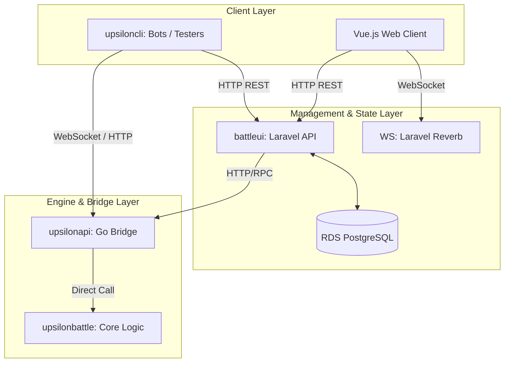

# Upsilon Hub: Architecture Anchor

**Date:** 2026-06-16
**Scope:** Global Project Architecture

## 1. System Overview

**UpsilonBattle** is a high-performance, turn-based Tactical RPG (TRPG) ecosystem designed for concurrent multiplayer combat and AI skirmishes. It operates on a multi-stack infrastructure, bridging a fast Go-based battle engine with a Laravel/Vue.js management layer and Python/JS testing CLI.

The core philosophy of the system is absolute traceability, heavily utilizing the **Atomic Traceable Documentation (ATD)** framework to govern mechanics, network rules, and business requirements.

## 2. Component Architecture

The ecosystem consists of specialized micro-repositories (Git Submodules) working in unison:

| Service Component | Tech Stack | Responsibilities | Default Ports |
|---|---|---|---|
| **`battleui`** | Laravel, Vue.js, Tailwind | UI, Session management, JWT Auth, Player Matchmaking, Global Leaderboard. | API: `8000`, WS: `8080`, Vue: `5173` |
| **`upsilonapi`** | Go | The "Bridge". High-performance JSON API. Handles account management, character stats, and database persistence. | API: `8081` |
| **`upsilonbattle`** | Go | The "Core Engine" (`BattleArena`). Calculates initiative, movement validation, damage, and combat state. | Embedded in `upsilonapi` |
| **`upsiloncli`** | JS / Python | Interactive terminal, AI Autopilot, end-to-end (E2E) testing, and bot orchestration. | N/A |

### 2.1 Shared Libraries
To enforce standard definitions across Go services, the following shared libraries are utilized:
- **`upsilontypes`**: Shared domain models, definitions, and types.
- **`upsilonserializer`**: Specialized Go serialization logic for the engine state.
- **`upsilonmapdata`**: Geometric board data structures and grid boundaries.
- **`upsilonmapmaker`**: Procedural generation tools for game maps.
- **`upsilontools`**: Shared utilities and mathematical helper functions.

## 3. Data Flow & Match Lifecycle

### 3.1 Flow Breakdown
1. **Match Creation**: Players request a match via `battleui`. The request is validated and sent to the `upsilonapi` bridge.
2. **Execution & Simulation**: `upsilonbattle` spins up an ephemeral `BattleArena` to manage the combat loop, initiative ticker (1-500), and action economy (Move/Attack/Pass/Delay costs).
3. **Broadcasting**: Live state updates are pushed via WebSocket connections (`8080`/`8081`).
4. **Resolution**: Upon elimination of a team (victory condition), the engine sends the match results back to `battleui` for final archiving and player progression tracking in PostgreSQL.

## 4. Engineering Standards & ATD Governance

The system enforces a **Zero Error Standard** audited by `scripts/code_health_check.py`.

### 4.1 Development Principles
- **Fail Fast & Crash Early**: Undefined behavior or silent failures are rejected in favor of explicit panics.
- **Zero Binary Commits**: Compiled outputs must be routed to `bin/` and gitignored.
- **API Envelope Strictness**: Communication layer protocols (`[[api_standard_envelope]]`) cannot be mutated without explicit documentation synchronization and approval.

### 4.2 ATD (Atomic Traceable Documentation)
All technical implementation MUST map to specific "Atoms" found in the `docs/` folder.
- **Rule of Traceability**: Every Go/PHP/JS source file must contain ATD links (`@spec-link`, `@test-link`) directly above relevant implementations.
- **Density Checks**: CI pipelines reject files missing ATD traceability, possessing excessive complexity (Nesting > 4), or exceeding length constraints (Warning: 400 LOC, Error: 600 LOC).

## 5. Deployment & Infrastructure

- **Local/CI Environment**: The ecosystem is containerized. `docker-compose.ci.yaml` orchestrates the stack for automated E2E tests and Autopilot journeys.
- **Production (`upsilonaws`)**: Bash-based AWS provisioning deploying to `eu-west-3`. Uses a VPC, EC2 (t3.medium), RDS Postgres 15, and an nginx proxy for SSL and routing.
