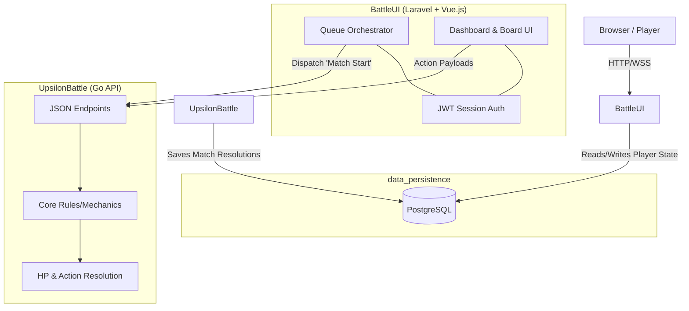

# TRPG Technical Specification

*Generated via ATD Synthesis*

## 1. Abstract Architecture Overview
UpsilonBattle employs a strictly microservice-oriented segregation of logic. The application is divided into three primary bounded contexts: A presentation/orchestration client (`BattleUI`), a pure computation API engine (`UpsilonBattle Go Backend`), and persistent memory (`data_persistence`).

## 2. Component Boundaries
### 2.1 BattleUI (Laravel / Vue.js / Tailwind)
**Tag Reference:** `@spec-link [[module_frontend]]`
- **Domain:** Presentation, Session Management, Pre-Game Orchestration.
- **Authentication:** Must implement and distribute stateless JWTs upon form authentication. Every protected route requires JWT evaluation (`req_security`).
- **Matchmaking Engine:** Handles the pairing queuing logic (Wait rooms). The Laravel server is responsible for grouping connection UUIDs and dispatching the final "Match Start" payload to the Go API.

### 2.2 UpsilonBattle Backend (Go / JSON API)
**Tag Reference:** `@spec-link [[module_backend]]`
- **Domain:** Combat Logic Math, Hit Detection, Board Mapping.
- **State Processing:** The backend evaluates "Move/Attack" JSON payloads dispatched by the Vue client against the server's single-source-of-truth board state.
- **Rules Engine:** Must enforce `mech_initiative` (delay math), `mech_action_economy` (the 30s timeout auto-pass), and `rule_friendly_fire`. Wait rooms and Matchmaking logic are completely omitted from this stack.

## 3. Integration & Network Contracts
- **Communication Protocol:** The Client and Laravel orchestrator converse via standard HTTP/JSON or Websockets (for the waiting room/real-time grid).
- **Backend API Structure:** The Go Backend must expose strict JSON payload contracts defining valid board updates (e.g. `POST /api/action {"unit_id": 12, "action": "move", "target": [x, y]}`).
- **JWT Trust Validation:** The Go Backend must possess the shared secret required to decode the JWT sent by the Laravel client, ensuring API callers are cryptographically verified.

## 4. Architecture Diagram

