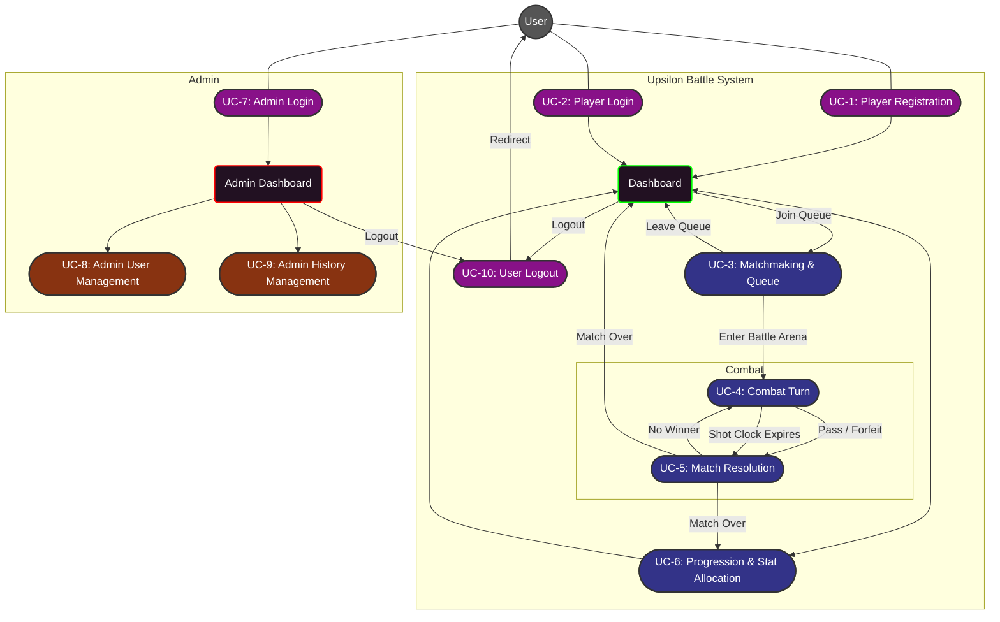

# Upsilon Battle Flows

---

## 1. UC-1: Player Registration
**Source:** [[uc_player_registration]] | **Actor:** User (Unauthenticated)

### Summary
Allows a new user to enter the ecosystem by creating a persistent account and establishing their initial character roster.

### Flow
1. Guest provides mandatory registration data (`Account Name`, `Password`, `Full Address`, `Birth Date`).
2. System validates data according to [[rule_password_policy]].
3. System generates an initial roster of characters.
4. Guest reviews and optionally rerolls the roster.
5. System persists the account and generates a JWT for authentication.
6. User is redirected to the Dashboard.

---

## 2. UC-2: Player Login
**Source:** [[uc_player_login]] | **Actor:** User (Unauthenticated)

### Summary
Authenticates an existing user and transitions their session to an active Player state, landing on the Character Review Dashboard.

### Flow
1. Guest provides `Account Name` and `Password`.
2. System validates credentials against stored hashes.
3. System generates a JWT and upgrades the session to Player status.
4. User is redirected to the Dashboard to review characters and progression.

---

## 3. UC-3: Matchmaking & Queue
**Source:** [[uc_matchmaking]] | **Actor:** User (Player Role)

### Summary
Facilitates the transition from the **Character Review Dashboard** to an active combat session, while allowing a return to the Dashboard (Leave Queue).

### Flow
1. From the Dashboard, the Player reviews their character roster and progression states.
2. Player selects a game mode (PvE or PvP) from the queue selection screen.
3. System enters the matchmaking queue.
4. **Transition (Wait)**: During the queue period, the User may choose to cancel and return to the **Dashboard** (Leave Queue).
5. **Transition (Start)**: Upon match assignment, System redirects the Player(s) to the tactical board.

---

## 4. UC-4: Combat Turn Management
**Source:** [[uc_combat_turn]] | **Actors:** User (Player Role), System

### Summary
Governs the tactical interaction within a match, ensuring fair play and adherence to the action economy.

### Logic
- **Initiative:** Turn order is dynamically calculated based on character stats and prior actions [[mech_initiative]].
- **Action Selection:** Player chooses between `Move`, `Attack`, `Pass`, or **`Forfeit`**.
- **Shot Clock:** 30-second timer per turn. Expiration results in a forced Pass and a +400 delay penalty [[mech_action_economy]].
- **Turn Conclusion:** Each character action (or timeout) triggers a state check in **UC-5**.

---

## 5. UC-5: Match Resolution
**Source:** [[uc_match_resolution]] | **Actors:** User (Player Role), System

### Summary
Evaluates the game state at the conclusion of each turn/action and handles the final match resolution.

### Logic
- **Win Detection**: System identifies a victor if opponent health reaches zero or if a player **Forfeits**.
- **State Check (No Winner)**: If no win condition is met at the end of a character turn, the flow returns to **UC-4** for the next character's turn.
- **Match Conclusion**: If a winner is detected, System persists results, awards progression rewards [[rule_progression]], and provides a transition choice between **Progression (UC-6)** or the **Dashboard**.

---

## 6. UC-6: Progression & Stat Allocation
**Source:** [[uc_progression_stat_allocation]] | **Actors:** User (Player Role), System

### Summary
Enables character growth through manual attribute point distribution, accessible from the Dashboard or immediately following a match.

### Logic
- **Character Review:** User reviews updated character stats and manually allocates earned attribute points [[us_win_progression]].
- **Stat Caps:** System enforces attribute limits (`10 + total_wins`) and movement upgrade gating (every 5 wins).
- **Navigation:** User can return to the **Dashboard** at any time to preserve the updated character state.

---

## 7. UC-7: Admin Login
**Source:** [[uc_admin_login]] | **Actor:** User (Unauthenticated)

### Summary
Authenticates an Administrator via a dedicated secure route, granting access to system management tools.

### Flow
1. Guest accesses the secure admin login endpoint.
2. Guest provides administrative credentials.
3. System validates credentials and confirms the `Admin` role.
4. System generates a high-privilege JWT.
5. Administrator is redirected to the **Admin Dashboard** [[ui_admin_dashboard]].

---

## 8. UC-8: Administrative User Management
**Source:** [[uc_admin_user_management]] | **Actor:** User (Admin Role)

### Summary
Provides administrative control over the user base, accessed via the **Admin Dashboard**.

### Logic
- **Pre-requisite:** Requires an active session and access through the **Admin Dashboard** [[ui_admin_dashboard]].
- **User Discovery:** Admin lists accounts (sensitive data like Address/Birth Date is hidden).
- **Account Termination:** Admin performs "Soft Deletes".
- **Anonymization:** Triggering a "Right to be Forgotten" overwrites personal data with "ANONYMIZED" placeholders [[rule_gdpr_compliance]].

---

## 9. UC-9: Admin History Management
**Source:** [[uc_admin_history_management]] | **Actors:** User (Admin Role), System

### Summary
Maintenance of the match database, restricted to authorized **Administrators** via the **Admin Dashboard**.

### Logic
- **Pre-requisite:** Requires access through the **Admin Dashboard**.
- **History Review:** Admin audits past match outcomes.
- **Database Maintenance:** Admin triggers a purge of records older than 90 days.
- **Automated Retention:** (System) Periodic cleanup of historical logs to prevent database bloat.
---

## 10. UC-10: User Logout
**Source:** [[uc_auth_logout]] | **Actors:** User (Player or Admin), System

### Summary
Terminates the active session for any authenticated user and redirects them back to the Landing Page.

### Flow
1. From the **Dashboard** or **Admin Dashboard**, the User initiates logout.
2. System invalidates the authentication token on the server [[api_auth_logout]].
3. System clears client-side session state.
4. User is redirected to the Landing Page (Guest state).
